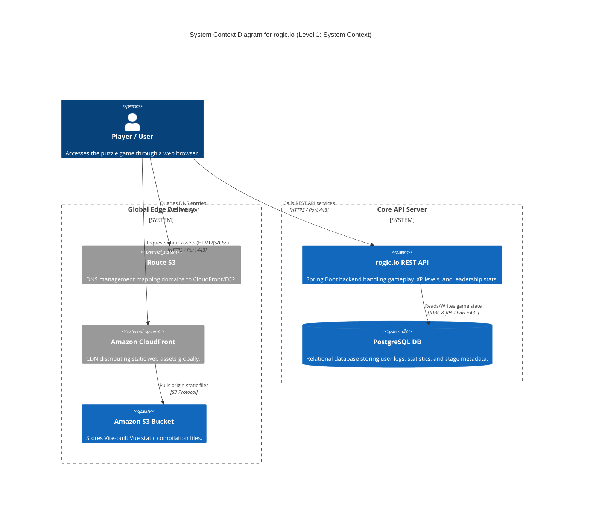
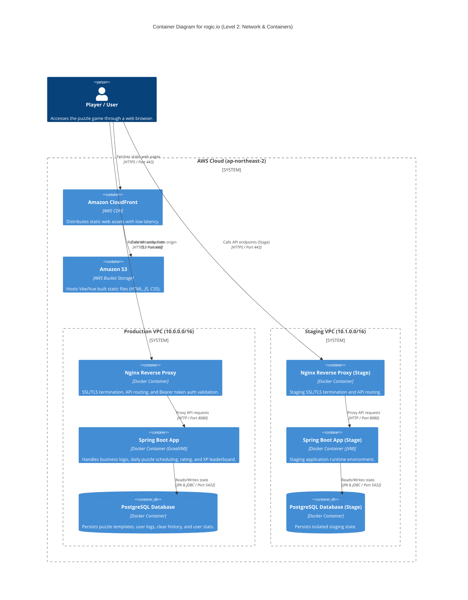
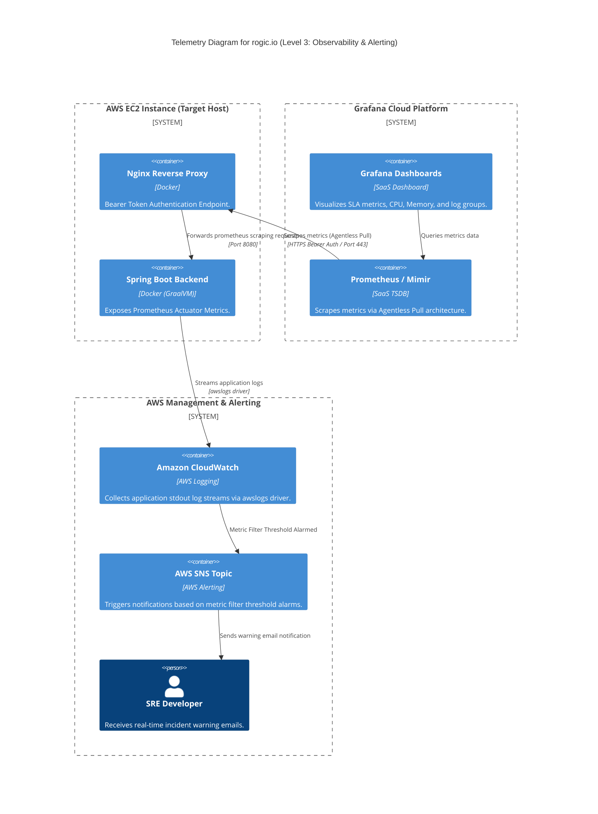
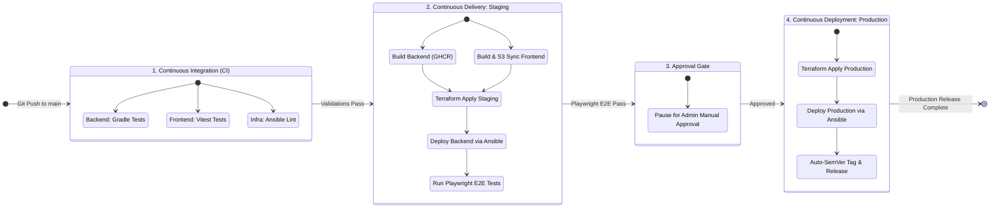

<div style="line-height: 1.6;">

[0.](#0-project-overview) Project Overview<br>
[1.](#1-infrastructure--cloud-engineering) Infrastructure & Cloud Engineering<br>
[1.1.](#11-system-architecture) System Architecture<br>
[1.1.1.](#111-high-level-diagram) High-Level Diagram<br>
[1.1.2.](#112-component-specification) Component Specification<br>
[1.2.](#12-cost-optimization) Cost Optimization<br>
[1.2.1.](#121-compute-resource-downsizing) Compute Resource Downsizing<br>
[1.2.2.](#122-high-availability--load-balancer-elimination) High Availability & Load Balancer Elimination<br>
[1.2.3.](#123-database-cost-minimization--replication) Database Cost Minimization & Replication<br>
[1.3.](#13-technical-trade-offs--mitigations) Technical Trade-offs & Mitigations<br>
[1.3.1.](#131-build-resource-constraints) Build Resource Constraints<br>
[1.3.2.](#132-single-point-of-failure-spof) Single Point of Failure (SPOF)<br>
[1.3.3.](#133-recovery-indicators-rto--rpo) Recovery Indicators (RTO / RPO)<br>
[1.4.](#14-network--security-architecture) Network & Security Architecture<br>
[1.4.1.](#141-network-isolation) Network Isolation<br>
[1.4.2.](#142-access-control) Access Control<br>
[1.4.3.](#143-ssltls-certificate-management) SSL/TLS Certificate Management<br>
[1.4.4.](#144-state-management-security) State Management Security<br>
[1.5.](#15-observability--sre-site-reliability-engineering) Observability & SRE (Site Reliability Engineering)<br>
[1.5.1.](#151-metric-collection--scraping) Metric Collection & Scraping<br>
[1.5.2.](#152-centralized-log-management) Centralized Log Management<br>
[1.5.3.](#153-alerting--notification) Alerting & Notification<br>
[1.5.4.](#154-slo-service-level-objective-visualization) SLO (Service Level Objective) Visualization<br>
[1.6.](#16-troubleshooting) Troubleshooting<br>
[1.6.1.](#161-t3anano512mb-ram-환경-내-메모리-스레싱thrashing-및-oom-장애-해결) t3a.nano(512MB RAM) 환경 내 메모리 스레싱(Thrashing) 및 OOM 장애 해결<br>
[2.](#2-continuous-integration--delivery-cicd) Continuous Integration & Delivery (CI/CD)<br>
[2.1.](#21-pipeline-workflow) Pipeline Workflow<br>
[2.1.1.](#211-gitops-flowchart) GitOps Flowchart<br>
[2.1.2.](#212-pipeline-trigger-optimization) Pipeline Trigger Optimization<br>
[2.2.](#22-build--artifact-management) Build & Artifact Management<br>
[2.2.1.](#221-compute-offloading) Compute Offloading<br>
[2.2.2.](#222-static-asset-delivery) Static Asset Delivery<br>
[2.3.](#23-quality-gate--release-automation) Quality Gate & Release Automation<br>
[2.3.1.](#231-automated-end-to-end-testing) Automated End-to-End Testing<br>
[2.3.2.](#232-deployment-gate--approvals) Deployment Gate & Approvals<br>
[2.3.3.](#233-automated-versioning) Automated Versioning<br>
[2.4.](#24-troubleshooting) Troubleshooting<br>
[2.4.1.](#241-staging-production-파이프라인-강결합-및-배포-동시성-제어-오류-극복) Staging-Production 파이프라인 강결합 및 배포 동시성 제어 오류 극복<br>
[3.](#3-ai-engineering--intelligent-systems) AI Engineering & Intelligent Systems<br>
[3.1.](#31-ai-puzzle-generator--logical-validation-pipeline) AI Puzzle Generator & Logical Validation Pipeline<br>
[3.1.1.](#311-model-integration--scheduler) Model Integration & Scheduler<br>
[3.1.2.](#312-automated-validation-pipeline) Automated Validation Pipeline<br>
[3.2.](#32-user-feedback-loop--governance-system) User Feedback Loop & Governance System<br>
[3.2.1.](#321-client-side-rating-system) Client-Side Rating System<br>
[3.2.2.](#322-backoffice-monitoring--cascading-deletes) Backoffice Monitoring & Cascading Deletes<br>
[3.2.3.](#323-ai-agentic-development--governance) AI Agentic Development & Governance<br>
[3.3.](#33-troubleshooting) Troubleshooting<br>
[3.3.1.](#331-gemini-초경량-모델의-데이터-생략js-array-초기화-표현식으로-인한-json-역직렬화-장애-대응) Gemini 초경량 모델의 데이터 생략(JS Array 초기화 표현식)으로 인한 JSON 역직렬화 장애 대응<br>
[4.](#4-appendices--local-setup) Appendices & Local Setup<br>
[4.1.](#41-technology-stack) Technology Stack<br>
[4.2.](#42-local-development-setup) Local Development Setup

---

# 0. Project Overview

| Service Environment | Live URL | Deployment Status |
| :--- | :--- | :--- |
| 🚀 **Production** | [rogic.io](https://rogic.io) |  |
| 🧪 **Staging** | [stage.rogic.io](https://stage.rogic.io) |  |

`rogic.io`는 그리드의 특정 영역을 회전시켜 숨겨진 패턴을 맞추는 변형 노노그램 퍼즐 게임입니다.

본 저장소는 프로젝트 빌드 및 배포에 필요한 CI/CD 파이프라인, IaC 기반 인프라 구성 코드(Terraform/Ansible), 그리고 모니터링 환경의 구축 명세를 담고 있습니다.

---

# 1. Infrastructure & Cloud Engineering

## 1.1. System Architecture

### 1.1.1. High-Level Diagram


### 1.1.2. Component Specification
* **Frontend Static Hosting**<br>
  Vite 컴파일 결과물을 `Amazon S3` 버킷(OAC 차단)에 호스팅하고, `Amazon CloudFront` CDN을 통해 정적 웹 리소스를 배포합니다.
* **Backend API Gateway**<br>
  Spring Boot 애플리케이션을 단일 EC2 인스턴스 내 Docker 컨테이너로 가동하며, 프론트엔드 레벨에는 Nginx 리버스 프록시를 배치하여 `api.rogic.io` / `api.stage.rogic.io` 경로에 SSL/TLS 종단 처리를 수행합니다.
* **Telemetry Proxy**<br>
  수집 데몬(Alloy) 설치를 배제하고 Nginx Bearer 토큰 검증을 이용해 Prometheus Actuator 엔드포인트를 외부에 간접 노출하여 수집 부하를 제거했습니다.

---

## 1.2. Cost Optimization
* **인프라 월간 운영 비용 분석 (Monthly Billing Summary)**<br>
  자원 다중화 및 관리형 DB 서비스 대신 가상 컨테이너 기술과 복구 지향형 설계를 연동하여 월 $11.45 (세후 실청구액 기준, 기존 대비 약 80% 비용 절감)의 상용 인프라 운영을 달성했습니다.

  | 구분 (Category) | 기존 구성 예상 비용 (Estimated) | 최적화 구성 실제 비용 (2026년 6월) | 주요 비고 (Key Notes) |
  | :--- | :--- | :--- | :--- |
  | **컴퓨팅 및 스토리지** | $20.00 / 월 (t3.micro) | $5.50 / 월 (t3a.nano + EBS) | GraalVM 네이티브 컨테이너화를 통해 메모리 스레싱 극복 |
  | **로드 밸런서** | $20.00 / 월 (AWS ALB) | $0.00 / 월 (Self-hosted Nginx) | ALB 제거 후 Route 53 고정 EIP 다이렉트 매핑 |
  | **데이터베이스** | $15.00 / 월 (RDS PostgreSQL) | $0.00 / 월 (PostgreSQL Container) | EC2 호스트 내부 Docker Compose 환경 가동 |
  | **네트워크 & 도메인** | - | $4.74 / 월 (IP 주소 + Route 53) | 퍼블릭 IPv4 사용료 ($3.70) + 호스팅 영역 ($1.04) |
  | **기타 (데이터 전송 등)** | - | $1.21 / 월 | 데이터 트래픽 전송 및 유틸리티 자원 비용 |
  | **합계 (Total)** | **약 $55.00 / 월** | **총 $11.45 / 월** | **기존 대비 약 80% 비용 절감 달성 (세후 실청구액)** |

### 1.2.1. Compute Resource Downsizing
* **t3a.nano/t4g.nano (512MB RAM) 타겟팅**<br>
  월 $3.5 대 컴퓨팅 인스턴스 사양에 맞추어 리소스를 튜닝했습니다.
* **GraalVM Native Image 메모리 최적화**<br>
  런타임 메모리 사용량을 컨테이너당 30MB 이하로 낮추어, 초경량 컴퓨팅 환경 내에서도 배포 시 두 버전의 Spring Boot 컨테이너를 함께 띄울 수 있는 기반을 다졌습니다.
  * **Jackson 역직렬화 DTO Reflection 힌트**<br>
    Native 빌드 오류 방지를 위해 [NemologicRuntimeHints.java](backend/src/main/java/com/devdoyen/nemologic/config/NemologicRuntimeHints.java)에 리플렉션 힌트를 명시했습니다.
* **Docker Garbage Collection 자동화**<br>
  디스크 용량 고갈 장애 예방을 위해 새벽 3시마다 72시간 경과 도커 리소스를 강제 소거하는 prune 스크립트를 크론탭으로 자동 배치했습니다.

### 1.2.2. High Availability & Load Balancer Elimination
* **ALB 제거 및 고정 EIP 구성**<br>
  월 $20 상당의 AWS ALB를 배제하고 DNS 도메인(Route 53)과 고정 Elastic IP를 매핑했습니다.
* **EC2 Auto Recovery 및 복구 지향 아키텍처(ROA)**<br>
  ALB 부재에 따른 장애 전파를 줄이기 위해 시스템 알람 연동 호스트 자동 복구(Auto Recovery)를 결합하고, 재해 복구 시 IaC 코드를 활용해 5분 이내 인프라를 복원하도록 구성했습니다.

### 1.2.3. Database Cost Minimization & Replication
* **Self-hosted PostgreSQL 컨테이너**<br>
  월 $15~20 이상의 RDS 비용을 아끼기 위해 EC2에 DB 컨테이너를 기동했습니다.
* **S3 정기 백업 및 Lifecycle 제어**<br>
  6시간 주기로 DB dump 데이터를 S3로 업로드하는 쉘 스크립트와 Cron을 배포하고, S3 백업 버킷에 30일 경과 백업 자동 파기 정책을 적용했습니다.

---

## 1.3. Technical Trade-offs & Mitigations
비용 최적화를 달성하기 위해 포기한 기술적 혜택(Trade-offs)과 이를 극복하기 위해 설계한 완화 대책(Mitigations)을 명시적으로 투명하게 공개합니다.

### 1.3.1. Build Resource Constraints
* **물리 메모리 고갈에 따른 컴파일 리스크 (Trade-off)**<br>
  t3a.nano(512MB RAM) 환경에서는 메모리 제약으로 인해 서버 내에서 직접 GraalVM 컴파일 빌드가 불가능하며, 빌드 속도 또한 JVM 컴파일에 비해 10배 이상 오래 소요됩니다.
* **외부 컴퓨팅 오프로딩 (Mitigation)**<br>
  CI/CD 파이프라인에서 GitHub Actions가 제공하는 외부 빌드 인프라(2 Core, 7GB RAM)에 컴파일 연산 부하를 위임하고, 운영 서버 호스트는 30MB 수준의 무부하 바이너리 구동만 전담하도록 분리 구조화했습니다.

### 1.3.2. Single Point of Failure (SPOF)
* **다중 AZ 로드밸런싱 포기 (Trade-off)**<br>
  AWS Load Balancer(ALB) 배제로 인해 다중 가용구역(Multi-AZ) 무중단 이중화 및 롤링 배포를 달성할 수 없으며, 호스트 물리 장애 시 전체 정전이 발생하는 단일 장애점(SPOF)을 노출하게 됩니다.
* **호스트 자동 복구 결합 (Mitigation)**<br>
  AWS CloudWatch Status Check Metric Alarms를 결합해 물리 하드웨어 결함 발생 시 1분 이내에 인스턴스를 정상 물리 호스트로 자동 복원(Auto Recovery)하여 EIP를 바인딩하도록 인프라 복원력을 강화했습니다.

### 1.3.3. Recovery Indicators (RTO / RPO)
* **관리형 DB Failover 및 시점 복구 상실 (Trade-off)**<br>
  AWS RDS의 완전관리형 이중화 복구(RTO 0초 타겟) 및 시점 복구(RPO 5분 이내 PITR) 편의성을 누릴 수 없으며, 재해 복구 시 백업 덤프 수동 복원이 필요하므로 RTO/RPO 지표가 수 분에서 최대 6시간 수준으로 후퇴합니다.
* **복구 지향 아키텍처(ROA) 구현 (Mitigation)**<br>
  인프라를 코드로 구성(Terraform/Ansible)하여 재설치 과정을 자동화하고, 6시간 주기 백업 덤프 자산을 독립 버킷 S3에 안전하게 보관하여 전체 데이터 유실 및 가상 머신 소멸 시에도 5분 이내 수동 복구 가능한 절차를 수립했습니다.

---

## 1.4. Network & Security Architecture

### 1.4.1. Network Isolation


* **물리 격리형 VPC 구성**<br>
  Staging VPC(`10.1.0.0/16`)와 Production VPC(`10.0.0.0/16`)를 개별 서브넷 대역과 독립 인프라망으로 분리 프로비저닝하여 상호 간의 간섭을 완전히 격리했습니다.

### 1.4.2. Access Control
* **보안 그룹 최소화 권장**<br>
  SSH(22), Nginx HTTP/S(80/443), Spring(8080) 이외의 외부 불필요한 포트 인바운드를 SG 방화벽 규칙을 통해 원천적으로 차단했습니다.

### 1.4.3. SSL/TLS Certificate Management
* **Let's Encrypt 및 Certbot 갱신**<br>
  HTTPS(443) 통신 및 HTTP(80) 301 리다이렉트 정책을 구현하였으며, 3개월 만료 인증서 자동 갱신을 지원하는 pre/post 쉘 스크립트 훅을 Certbot 데몬에 바인딩했습니다.

### 1.4.4. State Management Security
* **테라폼 원격 상태 잠금**<br>
  AWS S3 버킷과 DynamoDB 테이블(`LockID`)을 Backend로 연동해 개발자 배포 시 형상 관리(State)의 동시 수정 충돌을 원천 방지했습니다.

---

## 1.5. Observability & SRE (Site Reliability Engineering)

### 1.5.1. Metric Collection & Scraping


* **Agentless Pull 아키텍처**<br>
  호스트 리소스를 소모하는 수집기(Alloy) 대신, Nginx 프록시가 `Authorization: Bearer` 헤더 토큰을 대조 검증하는 가상 경로를 열고 외부 Grafana Cloud Mimir가 직접 긁어가도록 구조화했습니다.

### 1.5.2. Centralized Log Management
* **awslogs Docker 드라이버 연동**<br>
  컨테이너 출력을 AWS CloudWatch Logs(`/aws/ec2/nemologic`)로 실시간 포워딩하여 디스크 점유율을 줄였으며, 헬스체크 및 메트릭 수집 API 경로는 Nginx Access Log에서 제외(off) 처리했습니다.

### 1.5.3. Alerting & Notification
* **장애 감지 경보 연동**<br>
  CloudWatch Logs Metric Filter 오류 발생 시 AWS SNS를 경유해 개발자 메일로 상황이 실시간 통보되며, 도쿄·싱가포르·시드니 리전에서 동시에 `/actuator/health` 헬스체크 실패가 감지되면 Grafana 경보가 트리거됩니다.

### 1.5.4. SLO (Service Level Objective) Visualization
* **통합 관제 SLA 대시보드 ([current_dashboard.json](infra/monitoring/current_dashboard.json))**<br>
  SRE 핵심 품질 지표(Uptime SLA, Incident Count, MTTR, MTBF)를 Grafana 전역 시간 범위(Time Range Picker)에 동적으로 연동되도록 설계하여 단일 행 4열 KPI 카드 레이아웃에 맞춰 배치했습니다.
* **[Grafana Live Public Dashboard](https://grandwalrus3189.grafana.net/public-dashboards/ec9e06b0d1ea4540b97af6b56abb1380)**<br>
  레이아웃 구성 예시용 퍼블릭 링크 (보안 정책 상 실제 메트릭 데이터 대신 구조 확인용 임의 지표가 노출됩니다.)

#### [부록 1] SLA 지표 PromQL 연산 수식
* **API Health Status**<br>
  `sum(probe_success{job="nemologic-api-health", instance="https://rogic.io/actuator/health"})`
* **Dynamic Service Availability**<br>
  `avg_over_time(probe_success{job="nemologic-api-health", instance="https://rogic.io/actuator/health"}[$__range]) * 100`
* **Dynamic Incident Count**<br>
  `changes(probe_success{job="nemologic-api-health", instance="https://rogic.io/actuator/health"}[$__range]) / 2`
* **Dynamic MTTR (Mean Time To Recovery)**<br>
  `((count_over_time(probe_success{job="nemologic-api-health", instance="https://rogic.io/actuator/health"}[$__range]) - sum_over_time(probe_success{job="nemologic-api-health", instance="https://rogic.io/actuator/health"}[$__range])) * 60) / clamp_min(changes(probe_success{job="nemologic-api-health", instance="https://rogic.io/actuator/health"}[$__range]) / 2, 1)`
* **Dynamic MTBF (Mean Time Between Failures)**<br>
  `(sum_over_time(probe_success{job="nemologic-api-health", instance="https://rogic.io/actuator/health"}[$__range]) * 60) / clamp_min(changes(probe_success{job="nemologic-api-health", instance="https://rogic.io/actuator/health"}[$__range]) / 2, 1)`

#### [부록 2] 가용성 및 재해 복구 지표 비교표
| 지표 | 현재 사양 (단일 EC2 + S3 백업) | 향후 개선 목표 (Multi-AZ ALB + ECS/RDS) |
| :--- | :--- | :--- |
| **RPO (복구 시점)** | **6시간** (하루 4회 S3 백업 소산) | **5분 이내** (RDS Multi-AZ 및 PITR 자동 활성화) |
| **RTO (복구 시간)** | **약 20분** (Terraform 프로비저닝 복구 및 DB 덤프 복원) | **1분 이내** (ALB 액티브 백업 및 컨테이너 무중단 교체) |
| **MTBF (평균 고장 간격)** | **낮음** (t3a.nano 노드 리소스 병목 리스크 존재) | **매우 높음** (컴퓨팅 자원 분리 및 2GB 이상 스케일링) |
| **MTTR (평균 복구 시간)** | **약 10분** (경보 감지 후 관리자의 수동 개입 및 재부팅) | **10초 이내** (ALB 헬스체크 및 Fargate Self-healing 자동 복구) |

---

## 1.6. Troubleshooting

### 1.6.1. t3a.nano(512MB RAM) 환경 내 메모리 스레싱(Thrashing) 및 OOM 장애 해결
* **배경**<br>
  인프라 비용 극 최소화(월 $11.45 구성)를 위해 t3a.nano 인스턴스(512MB RAM) 환경을 선택하였으나, 모니터링 수집 에이전트(Grafana Alloy)의 메모리 점유(100MB+)와 블루/그린 배포 시점에 Spring Boot 컨테이너 2개가 일시적으로 동시에 기동하면서 물리 메모리 한계를 초과하여 OOM 및 CPU 스레싱 장애가 빈번히 발생함.
* **해결 방안**<br>
  - **Agentless Pull 아키텍처 도입**<br>
    호스트 리소스를 차지하는 수집 데몬(Alloy)을 배제. 대신 Nginx 리버스 프록시 단에서 Spring Actuator 메트릭 엔드포인트를 Bearer 토큰 보안 검증 하에 외부 노출하고, Grafana Cloud Prometheus가 원격으로 Pull(Scraping)하게 전환하여 모니터링 에이전트 구동에 따른 메모리 점유를 제거함.
  - **GraalVM Native Image 고도화**<br>
    빌드 타임 AOT 컴파일 및 Jackson 리플렉션 힌트 지정을 통해 Spring Boot 컨테이너 런타임 메모리 풋프린트를 기존 250MB+에서 **30MB 이하**로 극소화하여, 512MB RAM의 가혹한 물리 환경에서도 2개 컨테이너 무중단 교체 가용성을 안정적으로 유지함.
* **개발자 회고 (Retrospective)**<br>
  - 이 문제 해결 과정에서 코딩 AI 에이전트는 `t3a.nano` 환경의 리소스 임계치를 근거로 인스턴스 스케일업(micro/small로 업그레이드) 및 표준 관리형 아키텍처(ALB, RDS) 도입을 강력히 권장했습니다.
  - 물론 정석적인 모범 사례(Best Practice)에 따르는 편이 쉬운 길이었겠으나, **극단적인 비용 효율화와 한계 최적화**라는 프로젝트의 기술적 지향점을 지키기 위해 기술적 수단을 집요하게 모색했습니다.
  - 그 결과, 메트릭 수집 방식을 Push에서 Pull로 전환하고 GraalVM 메모리 풋프린트를 30MB 이하로 튜닝하는 등 깊이 있는 시스템 최적화 경험을 축적할 수 있었습니다. 도구(AI)의 제안을 맹신하지 않고, 프로젝트 상황에 맞게 주도적으로 아키텍처의 트레이드오프를 결정하는 역량의 중요성을 깨닫게 해준 값진 트러블슈팅 사례입니다. (자세한 인시던트 과정은 [Incident Report 2026-07-01](./docs/incidents/20260701_daily_puzzle_generation_failure.md) 참고)

---

# 2. Continuous Integration & Delivery (CI/CD)

## 2.1. Pipeline Workflow

### 2.1.1. GitOps Flowchart


### 2.1.2. Pipeline Trigger Optimization
* **경로 필터(Path Filtering)**<br>
  단순 문서나 로컬 마크다운 수정 커밋 유입 시에는 빌드/컴파일 단계를 스킵하여 배포 속도를 최적화했습니다.
* **배포 대기 취소(Concurrency)**<br>
  Staging 진행 중 추가 커밋이 수입되는 즉시 이전 배포 작업을 강제 취소(`cancel-in-progress: true`)해 배포의 꼬임 현상을 방지했습니다.

---

## 2.2. Build & Artifact Management

### 2.2.1. Compute Offloading
* **Actions Runner 컴파일 오프로딩**<br>
  512MB 호스트 내부의 컴파일 한계를 극복하기 위해 GitHub Actions Runner(7GB RAM) 환경에서 GraalVM Native AOT 컴파일을 수행하고 완료 이미지(`sha-${{ github.sha }}`)를 GHCR에 업로드해 운영 노드의 메모리 부하를 방지했습니다.

### 2.2.2. Static Asset Delivery
* **Vite Static Asset 동적 업로드**<br>
  프론트엔드는 도커 이미지 생성 대신 컴파일된 정적 자산(index.html, JS 번들)을 S3 버킷으로 다이렉트 동기화(`aws s3 sync`)하고 CloudFront Edge 무효화(Invalidation)를 호출하는 초경량 정적 호스팅 배포 방식을 수립했습니다.

---

## 2.3. Quality Gate & Release Automation

### 2.3.1. Automated End-to-End Testing
* **Playwright E2E 테스트**<br>
  Staging 배포 완료 즉시 Playwright 브라우저(`frontend/e2e/staging.spec.ts`)를 헤드리스 기동하여 홈 화면 로딩, 캔버스 노노그램 상호작용 및 익명 가입 로직을 실제 유저 브라우저 환경에서 자동 점검해 품질 게이트를 가동합니다.

### 2.3.2. Deployment Gate & Approvals
* **수동 승인 배포(Manual Gate)**<br>
  Staging 테스트가 100% 성공하면 빌드를 일시 정지시키고 관리자가 직접 GitHub Environment 상에서 릴리즈를 검증/승인해야만 Production으로 롤링 배포를 승격시키는 안전 장치를 구성했습니다.

### 2.3.3. Automated Versioning
* **Auto-SemVer 및 Release 자동 작성**<br>
  커밋 메시지 토큰(`feat:`, `fix:`) 규격을 파싱해 SemVer 버전을 갱신하고, 변경 이력(Changelog) 작성과 GitHub Release 릴리즈 발행 과정을 100% 자동화했습니다.

---

## 2.4. Troubleshooting

### 2.4.1. Staging-Production 파이프라인 강결합 및 배포 동시성 제어 오류 극복
* **배경**<br>
  - Staging과 Production 인프라 설정이 동일 Terraform 코드에 묶여 일괄 반영되던 중, 운영 환경 S3 버킷에 정적 자산이 시딩되지 않은 상태에서 DNS A 레코드가 CloudFront/S3로 먼저 스위칭되어 운영 전체 접속 차단(`AccessDenied`) 장애 발생 ([Access Failure Report](./docs/incidents/20260630_production_access_failure.md)).
  - 핫픽스 도중 GitHub Actions의 `cancel-in-progress: true` 설정으로 인해 Nginx 인증서 발급 프로세스 도중 후속 커밋이 이전 빌드를 강제 취소하면서 실서버 SSL 인증서 유실로 인한 HTTPS API 통신 불능 장애 발생 ([Handshake Failure Report](./docs/incidents/20260630_production_api_handshake_failure.md)).
* **해결 방안**<br>
  - **인프라 환경 물리 격리**<br>
    Terraform Workspace 및 디렉토리 구조를 Staging과 Production으로 엄격히 분할하여 단일 실행이 실 운영계에 즉각 영향을 미치지 않도록 조치.
  - **중요 배포 동시성 차단 옵션 제거**<br>
    중요 서버 설정 배포 단계(`deploy-production`)에서 `cancel-in-progress: false`를 명시하여 이전 작업이 중도 파기되는 설정 정합성 훼손을 원천 차단.
  - **배포 단계의 느슨한 결합(Loose Coupling)**<br>
    CloudFront TLS 및 SSL 인증서 교체 등의 상호 의존적인 작업들이 실제 서버 준비 상태를 검증한 후에 이루어지도록 수동 승인 게이트(Manual Approval Gate)를 도입해 인프라 프로모션 방식을 개선함.

---

# 3. AI Engineering & Intelligent Systems

## 3.1. AI Puzzle Generator & Logical Validation Pipeline

### 3.1.1. Model Integration & Scheduler
* **Gemini flash-lite 모델 API 연동**<br>
  무료 할당량(500 RPD)을 보유한 `gemini-3.1-flash-lite` LLM을 백엔드 스케줄러와 통합했습니다. 매일 새벽 04:17에 비활성 상태(`active = false`)로 퍼즐 후보를 생성해 DB에 안전하게 적재하며, 5초 지연 시간 및 3회 자동 재시도 장치로 Rate Limit 제한을 통제합니다.

### 3.1.2. Automated Validation Pipeline
* **논리해 자동 검증 및 정합성 제어**<br>
  유저가 찍어서 퍼즐을 맞추는 오류를 원천 차단하기 위해 Java 백엔드 단에 DFS 백트래킹 기반의 `isLogicalOnly(grid)` 알고리즘을 구현했습니다. 논리적인 추론만으로 정답에 도달할 수 있는지 판단하고, 5회 연속 후보 세트 통과 실패 시 예외를 던지는 품질 가드레일을 구축하여 완성된 퍼즐만 00:00에 노출합니다.

---

## 3.2. User Feedback Loop & Governance System

### 3.2.1. Client-Side Rating System
* **👍 / 👎 실시간 피드백 카드**<br>
  퍼즐 클리어 시 캔버스 하단 플로팅 카드 위젯(Glassmorphism 및 반응형 컬러 애니메이션)을 노출하여 사용자의 퍼즐 클리어 만족도를 직관적으로 평가 및 수집합니다.

### 3.2.2. Backoffice Monitoring & Cascading Deletes
* **만족도 통계 기반 즉각 삭제**<br>
  수집된 평점은 데이터베이스 `stages` 테이블의 `upvotes`/`downvotes`에 기록되며, 백오피스 테이블에서 SVG Outline 평점 그래픽으로 통계화됩니다. 품질이 미달되거나 왜곡된 AI 생성 퍼즐은 관리자가 식별하여 즉시 Hard Delete(Cascade)할 수 있습니다.

### 3.2.3. AI Agentic Development & Governance
* **AI 에이전트(Antigravity) 협업**<br>
  자율 코딩 에이전트 `Antigravity`를 기획·구현·TDD 테스트·관제 템플릿 배포의 전 과정에 동참시켜 수동 개발 영역을 자동화했습니다.
* **에이전트 이탈 방지용 거버넌스 규칙 (.agents/rules/)**:
  * **[workflow-and-tdd.md](.agents/rules/workflow-and-tdd.md)**<br>
    핵심 비즈니스 로직 수정 전 JUnit/Vitest 테스트 선행 작성(TDD) 규범 강제 및 `progress_state.md` 동기화 유도.
  * **[architecture-and-tech-stack.md](.agents/rules/architecture-and-tech-stack.md)**<br>
    Frontend/Backend/Infra 다중 레이어의 동시 이중 수정 차단 및 Vue Reactivity(Ref/Reactive)의 논리 연산 유출 방지.
  * **[safety-and-communication.md](.agents/rules/safety-and-communication.md)**<br>
    요구사항이 모호한 즉시 임의 구현(No Guessing)을 전면 중지시키고 개발자 승인 대기.
  * **[incident-reporting.md](.agents/rules/incident-reporting.md)**<br>
    장애 상황(빌드, 마이그레이션 실패 등) 복구 즉시 `docs/incidents/`에 YYYYMMDD 날짜 구조 포스트모템 장애보고서 자동 작성 및 보관 지침 명문화.

---

## 3.3. Troubleshooting

### 3.3.1. Gemini 초경량 모델의 데이터 생략(JS Array 초기화 표현식)으로 인한 JSON 역직렬화 장애 대응
* **배경**<br>
  데일리 퍼즐 생성 중, 초경량 LLM 모델인 `gemini-3.1-flash-lite`가 30x30 대형 그리드(900개 셀) 연산 결과물 생성 시 응답 지연을 방지하기 위해 표준 JSON 포맷 대신 `Array(30).fill(0)` 등 JavaScript 배열 생성 문법을 반환하여 백엔드 Jackson 역직렬화 오류(`JsonParseException`) 및 배치 스케줄러 전면 중단 장애 발생 ([Daily Puzzle Failure Report](./docs/incidents/20260701_daily_puzzle_generation_failure.md)).
* **해결 방안**<br>
  - **프롬프트 가드레일 강화**<br>
    AI 프롬프트에 `MUST be a literal 2D JSON array` 제약 명시 및 루프, 코드식 생략 표현 사용을 전면 불허하는 지침 추가.
  - **대형 그리드 생성 모델 부하 제어**<br>
    가로/세로 25개 이상의 대형 퍼즐 생성 시 AI 모델이 데이터를 생략하려는 경향성을 줄이기 위해 생성 후보군(Candidate) 개수를 5개에서 2개로 조정하여 출력 안전성 확보.

---

# 4. Appendices & Local Setup

## 4.1. Technology Stack
| Category | Technologies | Description |
| :--- | :--- | :--- |
| **Frontend** | `Vue 3`, `TypeScript`, `HTML5 Canvas API`, `Axios` | Client app with decoupled pure TS game engine. |
| **Backend** | `Java 17`, `Spring Boot`, `Spring Data JPA` | REST API layer for stage state, history, and users. |
| **Database** | `PostgreSQL 16` | Relational storage for user logs, clear history, and stages. |
| **Infra & IaC** | `AWS`, `Terraform`, `Ansible`, `Docker Compose` | Code-defined AWS resources & automated config deployment. |
| **CI/CD** | `GitHub Actions`, `Vitest`, `Playwright` | Path-filtered tests, browser E2E validation, auto-SemVer. |
| **Telemetry** | `Prometheus`, `Grafana Cloud`, `CloudWatch` | Agentless scraping, log alarms, SNS email alerting. |

## 4.2. Local Development Setup
To run `rogic.io` on your local workstation:

### Prerequisites
* Java 17 JDK
* Node.js 20+
* Docker & Docker Compose

### Step 1: Start PostgreSQL Database
```bash
# In project root
docker compose -f docker-compose.local.yml up -d db
```

### Step 2: Run Backend API
```bash
cd backend
./gradlew bootRun
```
* API Server will run on: `http://localhost:8080`

### Step 3: Run Frontend Client
```bash
cd frontend
npm install
npm run dev
```
* Frontend app will run on: `http://localhost:5173`

## 4.3. Custom Development Rules & Guidelines
본 프로젝트는 AI 코딩 에이전트와 인간 개발자가 협업 시 일관된 설계 사상과 운영 안정성을 유지하기 위해 `.agents/rules/` 하위에 명시적인 프로젝트 거버넌스 규칙을 정의하여 관리합니다. 에이전트는 작업 수행 시 아래의 모든 규정을 강제적으로 준수합니다.

| 규칙 파일 | 주요 관리 목적 및 정책 요약 | 형상 추적 여부 |
| :--- | :--- | :--- |
| [architecture-and-tech-stack.md](.agents/rules/architecture-and-tech-stack.md) | 프론트/백엔드 디렉토리 격리, Canvas API 강제, Terraform/Ansible Staging 순차 배포 준수 | `Git Tracked` |
| [documentation-guidelines.md](.agents/rules/documentation-guidelines.md) | 상대경로(file:// 금지) 사용, 마크다운 개행 규정, 비교 수치 기술 시 테이블(Table) 시각화 의무화 | `Git Tracked` |
| [git-and-commit-guidelines.md](.agents/rules/git-and-commit-guidelines.md) | Conventional Commits 영문 소문자 prefix 규칙 준수, 로컬 커밋 자동 보존 및 원격 push 개발자 위임 | `Git Tracked (Force Added)` |
| [workflow-and-tdd.md](.agents/rules/workflow-and-tdd.md) | 코어 로직 작성 시 TDD(Test-Driven Development) 선행 의무화 및 progress_state.md 수시 동기화 | `Git Tracked` |
| [incident-reporting.md](.agents/rules/incident-reporting.md) | 장애 리포트 작성 시 3W1H 사상에 근거한 구체적 원인-결과 수치 명세 규칙 | `Git Tracked` |
