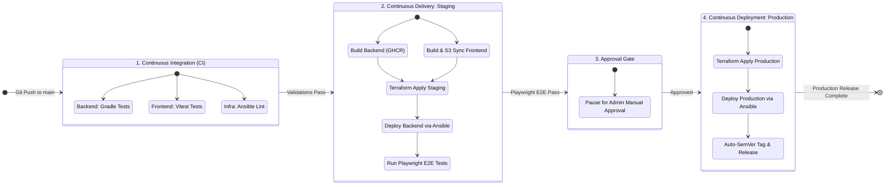

[0](#0-project-overview). Project Overview<br>
[1](#1-infrastructure--cloud-engineering). Infrastructure & Cloud Engineering<br>
&nbsp;&nbsp;&nbsp;&nbsp;[1-1](#1-1-system-architecture). System Architecture<br>
&nbsp;&nbsp;&nbsp;&nbsp;&nbsp;&nbsp;&nbsp;&nbsp;[1-1-1](#1-1-1-high-level-diagram). High-Level Diagram<br>
&nbsp;&nbsp;&nbsp;&nbsp;&nbsp;&nbsp;&nbsp;&nbsp;[1-1-2](#1-1-2-component-specification). Component Specification<br>
&nbsp;&nbsp;&nbsp;&nbsp;&nbsp;&nbsp;&nbsp;&nbsp;[1-1-3](#1-1-3-resource-dependency-graph). Resource Dependency Graph<br>
&nbsp;&nbsp;&nbsp;&nbsp;[1-2](#1-2-cost-optimization--technical-trade-offs). Cost Optimization & Technical Trade-offs<br>
&nbsp;&nbsp;&nbsp;&nbsp;&nbsp;&nbsp;&nbsp;&nbsp;[1-2-1](#1-2-1-compute-resource-downsizing). Compute Resource Downsizing<br>
&nbsp;&nbsp;&nbsp;&nbsp;&nbsp;&nbsp;&nbsp;&nbsp;[1-2-2](#1-2-2-high-availability--load-balancer-elimination). High Availability & Load Balancer Elimination<br>
&nbsp;&nbsp;&nbsp;&nbsp;&nbsp;&nbsp;&nbsp;&nbsp;[1-2-3](#1-2-3-database-cost-minimization--replication). Database Cost Minimization & Replication<br>
&nbsp;&nbsp;&nbsp;&nbsp;[1-3](#1-3-network--security-architecture). Network & Security Architecture<br>
&nbsp;&nbsp;&nbsp;&nbsp;&nbsp;&nbsp;&nbsp;&nbsp;[1-3-1](#1-3-1-network-isolation). Network Isolation<br>
&nbsp;&nbsp;&nbsp;&nbsp;&nbsp;&nbsp;&nbsp;&nbsp;[1-3-2](#1-3-2-access-control). Access Control<br>
&nbsp;&nbsp;&nbsp;&nbsp;&nbsp;&nbsp;&nbsp;&nbsp;[1-3-3](#1-3-3-ssltls-certificate-management). SSL/TLS Certificate Management<br>
&nbsp;&nbsp;&nbsp;&nbsp;&nbsp;&nbsp;&nbsp;&nbsp;[1-3-4](#1-3-4-state-management-security). State Management Security<br>
&nbsp;&nbsp;&nbsp;&nbsp;[1-4](#1-4-observability--sre-site-reliability-engineering). Observability & SRE (Site Reliability Engineering)<br>
&nbsp;&nbsp;&nbsp;&nbsp;&nbsp;&nbsp;&nbsp;&nbsp;[1-4-1](#1-4-1-metric-collection--scraping). Metric Collection & Scraping<br>
&nbsp;&nbsp;&nbsp;&nbsp;&nbsp;&nbsp;&nbsp;&nbsp;[1-4-2](#1-4-2-centralized-log-management). Centralized Log Management<br>
&nbsp;&nbsp;&nbsp;&nbsp;&nbsp;&nbsp;&nbsp;&nbsp;[1-4-3](#1-4-3-alerting--notification). Alerting & Notification<br>
&nbsp;&nbsp;&nbsp;&nbsp;&nbsp;&nbsp;&nbsp;&nbsp;[1-4-4](#1-4-4-slo-service-level-objective-visualization). SLO (Service Level Objective) Visualization<br>
[2](#2-continuous-integration--delivery-cicd). Continuous Integration & Delivery (CI/CD)<br>
&nbsp;&nbsp;&nbsp;&nbsp;[2-1](#2-1-pipeline-workflow). Pipeline Workflow<br>
&nbsp;&nbsp;&nbsp;&nbsp;&nbsp;&nbsp;&nbsp;&nbsp;[2-1-1](#2-1-1-gitops-flowchart). GitOps Flowchart<br>
&nbsp;&nbsp;&nbsp;&nbsp;&nbsp;&nbsp;&nbsp;&nbsp;[2-1-2](#2-1-2-pipeline-trigger-optimization). Pipeline Trigger Optimization<br>
&nbsp;&nbsp;&nbsp;&nbsp;[2-2](#2-2-build--artifact-management). Build & Artifact Management<br>
&nbsp;&nbsp;&nbsp;&nbsp;&nbsp;&nbsp;&nbsp;&nbsp;[2-2-1](#2-2-1-compute-offloading). Compute Offloading<br>
&nbsp;&nbsp;&nbsp;&nbsp;&nbsp;&nbsp;&nbsp;&nbsp;[2-2-2](#2-2-2-static-asset-delivery). Static Asset Delivery<br>
&nbsp;&nbsp;&nbsp;&nbsp;[2-3](#2-3-quality-gate--release-automation). Quality Gate & Release Automation<br>
&nbsp;&nbsp;&nbsp;&nbsp;&nbsp;&nbsp;&nbsp;&nbsp;[2-3-1](#2-3-1-automated-end-to-end-testing). Automated End-to-End Testing<br>
&nbsp;&nbsp;&nbsp;&nbsp;&nbsp;&nbsp;&nbsp;&nbsp;[2-3-2](#2-3-2-deployment-gate--approvals). Deployment Gate & Approvals<br>
&nbsp;&nbsp;&nbsp;&nbsp;&nbsp;&nbsp;&nbsp;&nbsp;[2-3-3](#2-3-3-automated-versioning). Automated Versioning<br>
[3](#3-ai-engineering--intelligent-systems). AI Engineering & Intelligent Systems<br>
&nbsp;&nbsp;&nbsp;&nbsp;[3-1](#3-1-ai-puzzle-generator--logical-validation-pipeline). AI Puzzle Generator & Logical Validation Pipeline<br>
&nbsp;&nbsp;&nbsp;&nbsp;&nbsp;&nbsp;&nbsp;&nbsp;[3-1-1](#3-1-1-model-integration--scheduler). Model Integration & Scheduler<br>
&nbsp;&nbsp;&nbsp;&nbsp;&nbsp;&nbsp;&nbsp;&nbsp;[3-1-2](#3-1-2-automated-validation-pipeline). Automated Validation Pipeline<br>
&nbsp;&nbsp;&nbsp;&nbsp;[3-2](#3-2-user-feedback-loop--governance-system). User Feedback Loop & Governance System<br>
&nbsp;&nbsp;&nbsp;&nbsp;&nbsp;&nbsp;&nbsp;&nbsp;[3-2-1](#3-2-1-client-side-rating-system). Client-Side Rating System<br>
&nbsp;&nbsp;&nbsp;&nbsp;&nbsp;&nbsp;&nbsp;&nbsp;[3-2-2](#3-2-2-backoffice-monitoring--cascading-deletes). Backoffice Monitoring & Cascading Deletes<br>
&nbsp;&nbsp;&nbsp;&nbsp;&nbsp;&nbsp;&nbsp;&nbsp;[3-2-3](#3-2-3-ai-agentic-development--governance). AI Agentic Development & Governance<br>
[4](#4-appendices--local-setup). Appendices & Local Setup<br>
&nbsp;&nbsp;&nbsp;&nbsp;[4-1](#4-1-technology-stack). Technology Stack<br>
&nbsp;&nbsp;&nbsp;&nbsp;[4-2](#4-2-local-development-setup). Local Development Setup

---

# 0. Project Overview

| Service Environment | Live URL | Deployment Status |
| :--- | :--- | :--- |
| 🚀 **Production** | [rogic.io](https://rogic.io) |  |
| 🧪 **Staging** | [stage.rogic.io](https://stage.rogic.io) |  |

`rogic.io`는 그리드의 특정 영역을 회전시켜 숨겨진 패턴을 맞추는 변형 노노그램 퍼즐 게임입니다.

본 저장소는 프로젝트 빌드 및 배포에 필요한 CI/CD 파이프라인, IaC 기반 인프라 구성 코드(Terraform/Ansible), 그리고 모니터링 환경의 구축 명세를 담고 있습니다.

---

# 1. Infrastructure & Cloud Engineering

## 1-1. System Architecture

### 1-1-1. High-Level Diagram


### 1-1-2. Component Specification
* **Frontend Static Hosting**<br>
  Vite 컴파일 결과물을 `Amazon S3` 버킷(OAC 차단)에 호스팅하고, `Amazon CloudFront` CDN을 통해 정적 웹 리소스를 배포합니다.
* **Backend API Gateway**<br>
  Spring Boot 애플리케이션을 단일 EC2 인스턴스 내 Docker 컨테이너로 가동하며, 프론트엔드 레벨에는 Nginx 리버스 프록시를 배치하여 `api.rogic.io` / `api.stage.rogic.io` 경로에 SSL/TLS 종단 처리를 수행합니다.
* **Telemetry Proxy**<br>
  수집 데몬(Alloy) 설치를 배제하고 Nginx Bearer 토큰 검증을 이용해 Prometheus Actuator 엔드포인트를 외부에 간접 노출하여 수집 부하를 제거했습니다.

### 1-1-3. Resource Dependency Graph
<details>
<summary>🔍 Click to view Inframap Generated Resource Dependency Graphs</summary>

* **Staging Environment Infrastructure Graph**
  
* **Production Environment Infrastructure Graph**
  

</details>

---

## 1-2. Cost Optimization & Technical Trade-offs
* **인프라 월간 운영 비용 분석 (Monthly Billing Summary)**<br>
  자원 다중화 및 관리형 DB 서비스 대신 가상 컨테이너 기술과 복구 지향형 설계를 연동하여 **월 $11.45 (세후 실청구액 기준, 기존 대비 약 80% 비용 절감)**의 상용 인프라 운영을 달성했습니다.
  * **기존 구성 예상 비용**: 약 $55.00/월 (ALB $20, RDS PostgreSQL $15, t3.micro EC2 $20 등)
  * **최적화 구성 실제 비용 (2026년 6월 청구 기준)**: 총 $11.45/월 (t3a.nano 인스턴스/EBS $5.50, 퍼블릭 IPv4 주소 사용료 $3.70, Route 53 호스팅 $1.04, 데이터 전송 및 기타 $1.21)

### 1-2-1. Compute Resource Downsizing
* **t3a.nano/t4g.nano (512MB RAM) 타겟팅**<br>
  월 $3.5 대 컴퓨팅 인스턴스 사양에 맞추어 리소스를 튜닝했습니다.
* **GraalVM Native Image 메모리 최적화**<br>
  런타임 메모리 사용량을 컨테이너당 30MB 이하로 낮추어, 초경량 컴퓨팅 환경 내에서도 배포 시 두 버전의 Spring Boot 컨테이너를 함께 띄울 수 있는 기반을 다졌습니다.
  * **Jackson 역직렬화 DTO Reflection 힌트**<br>
    Native 빌드 오류 방지를 위해 [NemologicRuntimeHints.java](backend/src/main/java/com/devdoyen/nemologic/config/NemologicRuntimeHints.java)에 리플렉션 힌트를 명시했습니다.
* **Docker Garbage Collection 자동화**<br>
  디스크 용량 고갈 장애 예방을 위해 새벽 3시마다 72시간 경과 도커 리소스를 강제 소거하는 prune 스크립트를 크론탭으로 자동 배치했습니다.

### 1-2-2. High Availability & Load Balancer Elimination
* **ALB 제거 및 고정 EIP 구성**<br>
  월 $20 상당의 AWS ALB를 배제하고 DNS 도메인(Route 53)과 고정 Elastic IP를 매핑했습니다.
* **EC2 Auto Recovery 및 복구 지향 아키텍처(ROA)**<br>
  ALB 부재에 따른 장애 전파를 줄이기 위해 시스템 알람 연동 호스트 자동 복구(Auto Recovery)를 결합하고, 재해 복구 시 IaC 코드를 활용해 5분 이내 인프라를 복원하도록 구성했습니다.

### 1-2-3. Database Cost Minimization & Replication
* **Self-hosted PostgreSQL 컨테이너**<br>
  월 $15~20 이상의 RDS 비용을 아끼기 위해 EC2에 DB 컨테이너를 기동했습니다.
* **S3 정기 백업 및 Lifecycle 제어**<br>
  6시간 주기로 DB dump 데이터를 S3로 업로드하는 쉘 스크립트와 Cron을 배포하고, S3 백업 버킷에 30일 경과 백업 자동 파기 정책을 적용했습니다.

---

## 1-3. Network & Security Architecture

### 1-3-1. Network Isolation
* **물리 격리형 VPC 구성**<br>
  Staging VPC(`10.1.0.0/16`)와 Production VPC(`10.0.0.0/16`)를 개별 서브넷 대역과 독립 인프라망으로 분리 프로비저닝하여 상호 간의 간섭을 완전히 격리했습니다.

### 1-3-2. Access Control
* **보안 그룹 최소화 권장**<br>
  SSH(22), Nginx HTTP/S(80/443), Spring(8080) 이외의 외부 불필요한 포트 인바운드를 SG 방화벽 규칙을 통해 원천적으로 차단했습니다.

### 1-3-3. SSL/TLS Certificate Management
* **Let's Encrypt 및 Certbot 갱신**<br>
  HTTPS(443) 통신 및 HTTP(80) 301 리다이렉트 정책을 구현하였으며, 3개월 만료 인증서 자동 갱신을 지원하는 pre/post 쉘 스크립트 훅을 Certbot 데몬에 바인딩했습니다.

### 1-3-4. State Management Security
* **테라폼 원격 상태 잠금**<br>
  AWS S3 버킷과 DynamoDB 테이블(`LockID`)을 Backend로 연동해 개발자 배포 시 형상 관리(State)의 동시 수정 충돌을 원천 방지했습니다.

---

## 1-4. Observability & SRE (Site Reliability Engineering)

### 1-4-1. Metric Collection & Scraping
* **Agentless Pull 아키텍처**<br>
  호스트 리소스를 소모하는 수집기(Alloy) 대신, Nginx 프록시가 `Authorization: Bearer` 헤더 토큰을 대조 검증하는 가상 경로를 열고 외부 Grafana Cloud Mimir가 직접 긁어가도록 구조화했습니다.

### 1-4-2. Centralized Log Management
* **awslogs Docker 드라이버 연동**<br>
  컨테이너 출력을 AWS CloudWatch Logs(`/aws/ec2/nemologic`)로 실시간 포워딩하여 디스크 점유율을 줄였으며, 헬스체크 및 메트릭 수집 API 경로는 Nginx Access Log에서 제외(off) 처리했습니다.

### 1-4-3. Alerting & Notification
* **장애 감지 경보 연동**<br>
  CloudWatch Logs Metric Filter 오류 발생 시 AWS SNS를 경유해 개발자 메일로 상황이 실시간 통보되며, 도쿄·싱가포르·시드니 리전에서 동시에 `/actuator/health` 헬스체크 실패가 감지되면 Grafana 경보가 트리거됩니다.

### 1-4-4. SLO (Service Level Objective) Visualization
* **통합 관제 SLA 대시보드 ([current_dashboard.json](infra/monitoring/current_dashboard.json))**<br>
  SRE 핵심 품질 지표(Uptime SLA, Incident Count, MTTR, MTBF)를 복구 탑재하여 3열 카드 레이아웃에 맞춰 배치했습니다.
* **[Grafana Live Public Dashboard](https://grandwalrus3189.grafana.net/public-dashboards/ec9e06b0d1ea4540b97af6b56abb1380)**<br>
  레이아웃 구성 예시용 퍼블릭 링크 (보안 정책 상 실제 메트릭 데이터 대신 구조 확인용 임의 지표가 노출됩니다.)

#### [부록 1] SLA 지표 PromQL 연산 수식
* **API Health Status**<br>
  `sum(probe_success{job="nemologic-api-health", instance="https://rogic.io/actuator/health"})`
* **30-Day Service Availability**<br>
  `avg_over_time(probe_success{job="nemologic-api-health", instance="https://rogic.io/actuator/health"}[30d]) * 100`
* **30-Day Incident Count**<br>
  `changes(probe_success{job="nemologic-api-health", instance="https://rogic.io/actuator/health"}[30d]) / 2`
* **MTTR (Mean Time To Recovery)**<br>
  `((count_over_time(probe_success{job="nemologic-api-health", instance="https://rogic.io/actuator/health"}[30d]) - sum_over_time(probe_success{job="nemologic-api-health", instance="https://rogic.io/actuator/health"}[30d])) * 60) / clamp_min(changes(probe_success{job="nemologic-api-health", instance="https://rogic.io/actuator/health"}[30d]) / 2, 1)`
* **MTBF (Mean Time Between Failures)**<br>
  `(sum_over_time(probe_success{job="nemologic-api-health", instance="https://rogic.io/actuator/health"}[30d]) * 60) / clamp_min(changes(probe_success{job="nemologic-api-health", instance="https://rogic.io/actuator/health"}[30d]) / 2, 1)`

#### [부록 2] 가용성 및 재해 복구 지표 비교표
| 지표 | 현재 사양 (단일 EC2 + S3 백업) | 향후 개선 목표 (Multi-AZ ALB + ECS/RDS) |
| :--- | :--- | :--- |
| **RPO (복구 시점)** | **6시간** (하루 4회 S3 백업 소산) | **5분 이내** (RDS Multi-AZ 및 PITR 자동 활성화) |
| **RTO (복구 시간)** | **약 20분** (Terraform 프로비저닝 복구 및 DB 덤프 복원) | **1분 이내** (ALB 액티브 백업 및 컨테이너 무중단 교체) |
| **MTBF (평균 고장 간격)** | **낮음** (t3a.nano 노드 리소스 병목 리스크 존재) | **매우 높음** (컴퓨팅 자원 분리 및 2GB 이상 스케일링) |
| **MTTR (평균 복구 시간)** | **약 10분** (경보 감지 후 관리자의 수동 개입 및 재부팅) | **10초 이내** (ALB 헬스체크 및 Fargate Self-healing 자동 복구) |

---

# 2. Continuous Integration & Delivery (CI/CD)

## 2-1. Pipeline Workflow

### 2-1-1. GitOps Flowchart


### 2-1-2. Pipeline Trigger Optimization
* **경로 필터(Path Filtering)**<br>
  단순 문서나 로컬 마크다운 수정 커밋 유입 시에는 빌드/컴파일 단계를 스킵하여 배포 속도를 최적화했습니다.
* **배포 대기 취소(Concurrency)**<br>
  Staging 진행 중 추가 커밋이 수입되는 즉시 이전 배포 작업을 강제 취소(`cancel-in-progress: true`)해 배포의 꼬임 현상을 방지했습니다.

---

## 2-2. Build & Artifact Management

### 2-2-1. Compute Offloading
* **Actions Runner 컴파일 오프로딩**<br>
  512MB 호스트 내부의 컴파일 한계를 극복하기 위해 GitHub Actions Runner(7GB RAM) 환경에서 GraalVM Native AOT 컴파일을 수행하고 완료 이미지(`sha-${{ github.sha }}`)를 GHCR에 업로드해 운영 노드의 메모리 부하를 방지했습니다.

### 2-2-2. Static Asset Delivery
* **Vite Static Asset 동적 업로드**<br>
  프론트엔드는 도커 이미지 생성 대신 컴파일된 정적 자산(index.html, JS 번들)을 S3 버킷으로 다이렉트 동기화(`aws s3 sync`)하고 CloudFront Edge 무효화(Invalidation)를 호출하는 초경량 정적 호스팅 배포 방식을 수립했습니다.

---

## 2-3. Quality Gate & Release Automation

### 2-3-1. Automated End-to-End Testing
* **Playwright E2E 테스트**<br>
  Staging 배포 완료 즉시 Playwright 브라우저(`frontend/e2e/staging.spec.ts`)를 헤드리스 기동하여 홈 화면 로딩, 캔버스 노노그램 상호작용 및 익명 가입 로직을 실제 유저 브라우저 환경에서 자동 점검해 품질 게이트를 가동합니다.

### 2-3-2. Deployment Gate & Approvals
* **수동 승인 배포(Manual Gate)**<br>
  Staging 테스트가 100% 성공하면 빌드를 일시 정지시키고 관리자가 직접 GitHub Environment 상에서 릴리즈를 검증/승인해야만 Production으로 롤링 배포를 승격시키는 안전 장치를 구성했습니다.

### 2-3-3. Automated Versioning
* **Auto-SemVer 및 Release 자동 작성**<br>
  커밋 메시지 토큰(`feat:`, `fix:`) 규격을 파싱해 SemVer 버전을 갱신하고, 변경 이력(Changelog) 작성과 GitHub Release 릴리즈 발행 과정을 100% 자동화했습니다.

---

# 3. AI Engineering & Intelligent Systems

## 3-1. AI Puzzle Generator & Logical Validation Pipeline

### 3-1-1. Model Integration & Scheduler
* **Gemini flash-lite 모델 API 연동**<br>
  무료 할당량(500 RPD)을 보유한 `gemini-3.1-flash-lite` LLM을 백엔드 스케줄러와 통합했습니다. 매일 새벽 04:17에 비활성 상태(`active = false`)로 퍼즐 후보를 생성해 DB에 안전하게 적재하며, 5초 지연 시간 및 3회 자동 재시도 장치로 Rate Limit 제한을 통제합니다.

### 3-1-2. Automated Validation Pipeline
* **논리해 자동 검증 및 정합성 제어**<br>
  유저가 찍어서 퍼즐을 맞추는 오류를 원천 차단하기 위해 Java 백엔드 단에 DFS 백트래킹 기반의 `isLogicalOnly(grid)` 알고리즘을 구현했습니다. 논리적인 추론만으로 정답에 도달할 수 있는지 판단하고, 5회 연속 후보 세트 통과 실패 시 예외를 던지는 품질 가드레일을 구축하여 완성된 퍼즐만 00:00에 노출합니다.

---

## 3-2. User Feedback Loop & Governance System

### 3-2-1. Client-Side Rating System
* **👍 / 👎 실시간 피드백 카드**<br>
  퍼즐 클리어 시 캔버스 하단 플로팅 카드 위젯(Glassmorphism 및 반응형 컬러 애니메이션)을 노출하여 사용자의 퍼즐 클리어 만족도를 직관적으로 평가 및 수집합니다.

### 3-2-2. Backoffice Monitoring & Cascading Deletes
* **만족도 통계 기반 즉각 삭제**<br>
  수집된 평점은 데이터베이스 `stages` 테이블의 `upvotes`/`downvotes`에 기록되며, 백오피스 테이블에서 SVG Outline 평점 그래픽으로 통계화됩니다. 품질이 미달되거나 왜곡된 AI 생성 퍼즐은 관리자가 식별하여 즉시 Hard Delete(Cascade)할 수 있습니다.

### 3-2-3. AI Agentic Development & Governance
* **AI 에이전트(Antigravity) 협업**<br>
  자율 코딩 에이전트 `Antigravity`를 기획·구현·TDD 테스트·관제 템플릿 배포의 전 과정에 동참시켜 수동 개발 영역을 자동화했습니다.
* **에이전트 이탈 방지용 거버넌스 규칙 (.agents/rules/)**:
  * **[workflow-and-tdd.md](.agents/rules/workflow-and-tdd.md)**<br>
    핵심 비즈니스 로직 수정 전 JUnit/Vitest 테스트 선행 작성(TDD) 규범 강제 및 `progress_state.md` 동기화 유도.
  * **[architecture-and-tech-stack.md](.agents/rules/architecture-and-tech-stack.md)**<br>
    Frontend/Backend/Infra 다중 레이어의 동시 이중 수정 차단 및 Vue Reactivity(Ref/Reactive)의 논리 연산 유출 방지.
  * **[safety-and-communication.md](.agents/rules/safety-and-communication.md)**<br>
    요구사항이 모호한 즉시 임의 구현(No Guessing)을 전면 중지시키고 개발자 승인 대기.
  * **[incident-reporting.md](.agents/rules/incident-reporting.md)**<br>
    장애 상황(빌드, 마이그레이션 실패 등) 복구 즉시 `docs/incidents/`에 YYYYMMDD 날짜 구조 포스트모템 장애보고서 자동 작성 및 보관 지침 명문화.

---

# 4. Appendices & Local Setup

## 4-1. Technology Stack
| Category | Technologies | Description |
| :--- | :--- | :--- |
| **Frontend** | `Vue 3`, `TypeScript`, `HTML5 Canvas API`, `Axios` | Client app with decoupled pure TS game engine. |
| **Backend** | `Java 17`, `Spring Boot`, `Spring Data JPA` | REST API layer for stage state, history, and users. |
| **Database** | `PostgreSQL 16` | Relational storage for user logs, clear history, and stages. |
| **Infra & IaC** | `AWS`, `Terraform`, `Ansible`, `Docker Compose` | Code-defined AWS resources & automated config deployment. |
| **CI/CD** | `GitHub Actions`, `Vitest`, `Playwright` | Path-filtered tests, browser E2E validation, auto-SemVer. |
| **Telemetry** | `Prometheus`, `Grafana Cloud`, `CloudWatch` | Agentless scraping, log alarms, SNS email alerting. |

## 4-2. Local Development Setup
To run `rogic.io` on your local workstation:

### Prerequisites
* Java 17 JDK
* Node.js 20+
* Docker & Docker Compose

### Step 1: Start PostgreSQL Database
```bash
# In project root
docker compose -f docker-compose.local.yml up -d db
```

### Step 2: Run Backend API
```bash
cd backend
./gradlew bootRun
```
* API Server will run on: `http://localhost:8080`

### Step 3: Run Frontend Client
```bash
cd frontend
npm install
npm run dev
```
* Frontend app will run on: `http://localhost:5173`
