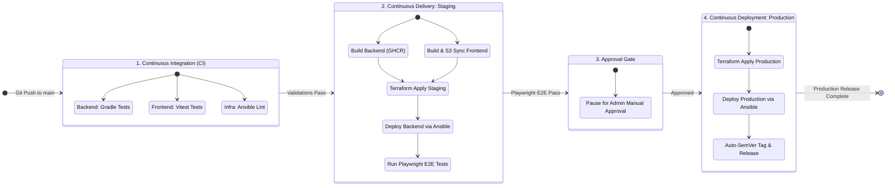

# rogic.io (Rotate Logic Nonogram Puzzle)

[](https://github.com/devdoyen/rogic.io/actions/workflows/ci-cd.yml)

🚀 **Live Services**:
- **Production Environment**: [rogic.io](https://rogic.io)
- **Staging Environment**: [stage.rogic.io](https://stage.rogic.io)

`rogic.io`는 3차원 서브 그리드 회전 역학을 도입한 차세대 노노그램 논리 퍼즐 플랫폼입니다. 플레이어는 그리드의 특정 섹션을 회전하고 패턴을 맞추어 숨겨진 그림을 찾아냅니다.

본 저장소는 자동화된 CI/CD 파이프라인, 선언적 IaC 클라우드 프로비저닝, 구성 관리 자동화, 그리고 애플리케이션 가용성과 보안성을 극대화한 실무 수준의 인프라 아키텍처 포트폴리오를 포함하고 있습니다.

---

## 📋 Table of Contents
- [🛠 Technology Stack](#-technology-stack)
- [1. Infrastructure & Cloud Engineering](#1-infrastructure--cloud-engineering)
  - [1-1. System Architecture](#1-1-system-architecture)
  - [1-2. Cost Optimization & Technical Trade-offs](#1-2-cost-optimization--technical-trade-offs)
  - [1-3. Network & Security Architecture](#1-3-network--security-architecture)
  - [1-4. Observability & SRE (Site Reliability Engineering)](#1-4-observability--sre-site-reliability-engineering)
- [2. Continuous Integration & Delivery (CI/CD)](#2-continuous-integration--delivery-cicd)
  - [2-1. Pipeline Workflow](#2-1-pipeline-workflow)
  - [2-2. Build & Artifact Management](#2-2-build--artifact-management)
  - [2-3. Quality Gate & Release Automation](#2-3-quality-gate--release-automation)
- [3. AI Engineering & Intelligent Systems](#3-ai-engineering--intelligent-systems)
  - [3-1. AI Puzzle Generator & Logical Validation Pipeline](#3-1-ai-puzzle-generator--logical-validation-pipeline)
  - [3-2. User Feedback Loop & Governance System](#3-2-user-feedback-loop--governance-system)
- [💻 Local Development Setup](#-local-development-setup)

---

## 🛠 Technology Stack

| Category | Technologies | Description |
| :--- | :--- | :--- |
| **Frontend** | `Vue 3`, `TypeScript`, `HTML5 Canvas API`, `Axios` | Client app with decoupled pure TS game engine. |
| **Backend** | `Java 17`, `Spring Boot`, `Spring Data JPA` | REST API layer for stage state, history, and users. |
| **Database** | `PostgreSQL 16` | Relational storage for user logs, clear history, and stages. |
| **Infra & IaC** | `AWS`, `Terraform`, `Ansible`, `Docker Compose` | Code-defined AWS resources & automated config deployment. |
| **CI/CD** | `GitHub Actions`, `Vitest`, `Playwright` | Path-filtered tests, browser E2E validation, auto-SemVer. |
| **Telemetry** | `Prometheus`, `Grafana Cloud`, `CloudWatch` | Agentless scraping, log alarms, SNS email alerting. |

---

## 1. Infrastructure & Cloud Engineering

### 1-1. System Architecture
극단적인 비용 최적화를 유지하면서 가용성과 복구 속도를 보장하도록 설계된 인프라 구조입니다.


* **Frontend Hosting & Multi-Origin CDN**: Vite 정적 빌드 자산을 `Amazon S3`에 호스팅(OAC 보안 적용)하고, `Amazon CloudFront` CDN을 통해 글로벌 배포합니다.
* **Backend API & E2E HTTPS**: EC2 상에서 Spring Boot 앱이 도커 컨테이너로 기동되며, Nginx가 리버스 프록시 및 SSL/TLS 종단점으로 전면 배치됩니다. 전용 백엔드 서브도메인(`api.rogic.io` / `api.stage.rogic.io`)과 CDN Multi-Origin 규칙을 설정하여 전 구간 HTTPS 통신을 보장합니다.
* **Telemetry**: 호스트 내 Alloy 에이전트를 배제하고 Nginx 토큰 인증 헤더(`Authorization: Bearer`) 검증을 통해 Prometheus Actuator 경로만 외부에 개방하여 Grafana Cloud가 직접 수집(Agentless Pull)하도록 설계했습니다.

<details>
<summary>🔍 Click to view Inframap Generated Resource Dependency Graphs</summary>

#### Staging Environment Infrastructure Graph


#### Production Environment Infrastructure Graph


</details>

### 1-2. Cost Optimization & Technical Trade-offs
운영 비용 최소화와 실무급 복구 가용성 확보 간의 절충안 설계입니다.

* **ALB(Load Balancer) 배제를 통한 가용성 타협**
  * **비용 절감**: AWS ALB 고정 비용(월 약 $20) 대신 Route 53 DNS와 고정 탄력적 IP(EIP) 단일 EC2 구조로 타협했습니다.
  * **보완 대책**: 장애 발생 시 건강한 물리 서버로 마이그레이션 기동을 트리거하는 **EC2 Auto Recovery**를 연동하고, 재해 발생 시 IaC 코드로 5분 내 복구하는 **복구 지향형 아키텍처**를 수립했습니다.
  * **Active-Active 무중단 배포**: GraalVM Native Image 도입으로 컨테이너당 메모리를 30MB 안팎으로 경량화하여, 배포 완료 후에도 Blue/Green 컨테이너가 모두 가동되는 Active-Active 구조를 유지합니다.
* **PostgreSQL 컨테이너 및 S3 백업 파이프라인 (RDS 대체)**
  * **비용 절감**: AWS RDS 구동 비용(월 약 $15~20) 대신 EC2 내 PostgreSQL 컨테이너를 구동합니다.
  * **보완 대책**: 매 6시간마다 DB 덤프를 압축해 S3로 이중화 백업하는 스크립트/크론탭을 연동하고, S3 버킷에 30일 경과 데이터 자동 삭제 수명 주기(Lifecycle Rules)를 적용했습니다.
* **자원 제약 환경에 따른 컴퓨팅 및 모니터링 최적화**
  * **비용 절감**: 월 $3.5 수준의 극저비용 인스턴스인 `t3.nano` / `t4g.nano` (512MB RAM) 환경을 타겟팅합니다.
  * **보완 대책**:
    * **AOT 컴파일 및 Reflection 힌트**: Spring Boot 애플리케이션에 GraalVM AOT 컴파일을 적용하고, Jackson 역직렬화 DTO 클래스들의 Reflection 런타임 힌트([NemologicRuntimeHints.java](file:///c:/Users/82107/dev/project/nemologic/backend/src/main/java/com/devdoyen/nemologic/config/NemologicRuntimeHints.java))를 명시적으로 등록해 AOT 빌드 오류를 방지했습니다.
    * **Docker Garbage Collection 자동화**: 디스크 고갈 방지를 위해 매일 새벽 3시마다 72시간 동안 미사용된 컨테이너 레이어, 볼륨, 이미지 캐시를 강제 소거하는 prune 스크립트를 Ansible로 자동 배포했습니다.

### 1-3. Network & Security Architecture
* **VPC 사설망 격리**: Staging VPC(`10.1.0.0/16`, 서브넷 `10.1.1.0/24`)와 Production VPC(`10.0.0.0/16`, 서브넷 `10.0.1.0/24`)를 독립적인 VPC망으로 완전 분리하여 물리적으로 격리했습니다.
* **보안 그룹 최소 권한 권장**: SSH(22), Nginx HTTP(80), HTTPS(443), Spring Boot HTTP(8080) 포트 인입만 보안 그룹을 통해 수용하고 아웃바운드는 전면 오픈했습니다.
* **HTTPS 보안 및 인증서 자동 갱신**: Let's Encrypt 멀티도메인 인증서를 연동하고 HTTP(80) 301 강제 HTTPS 리다이렉트를 Nginx에 구현했으며, pre/post hooks 쉘 스크립트를 Certbot에 통합 구성해 자동 갱신되도록 조치했습니다.
* **형상 잠금 (State Locking)**: S3 버킷과 DynamoDB 테이블(`LockID` 해시 키)을 테라폼 원격 백엔드로 결합하여 배포 시 발생하는 형상(State) 충돌을 차단했습니다.

### 1-4. Observability & SRE (Site Reliability Engineering)
* **Agentless Pull 메트릭 수집**: Alloy 에이전트를 제거하고, Node Exporter와 Actuator Prometheus 엔드포인트를 Nginx Bearer Token 검증과 결합해 외부 Grafana Cloud로 원격 Scrape 되도록 개방했습니다.
* **Docker awslogs 드라이버 연동**: 컨테이너 표준 출력을 AWS CloudWatch Logs `/aws/ec2/nemologic` 로그 그룹으로 직접 Offload하여 로컬 디스크/메모리 점유를 최소화하고 Logs Metric Filter 경보 및 SNS 이메일 전파망을 구축했습니다.
* **Synthetic Monitoring & SLA 대시보드 (IaC)**:
  * 도쿄, 싱가포르, 시드니 리전 Probes가 `/actuator/health` 엔드포인트를 60초 주기로 검증하며, 3개 프로브 동시 실패 감지 시 긴급 장애 이메일이 발송되도록 Grafana rule을 코드로 정의했습니다.
  * 통합 대시보드 스키마([current_dashboard.json](file:///c:/Users/82107/dev/project/nemologic/infra/monitoring/current_dashboard.json))에 SRE 관제의 핵심인 기간별 SLA 지표(Incident Count, Uptime SLA, MTTR, MTBF)를 복구 탑재하여 3열 카드형 레이아웃 형태로 배치 관리하고 있습니다.
  * **대시보드 레이아웃 확인용 퍼블릭 링크**: [Grafana Live Public Dashboard](https://grandwalrus3189.grafana.net/public-dashboards/ec9e06b0d1ea4540b97af6b56abb1380) 링크를 통해 구축된 모니터링 시스템의 시각화 레이아웃 및 차트 배치 구조를 외부에서도 직접 확인해 볼 수 있습니다. (보안 정책 상 실제 메트릭 데이터 대신 구조 확인용 임의 지표가 노출됩니다.)

#### [부록] SLA 및 신뢰성 분석을 위한 PromQL 수식 정의
* **실시간 가동 여부 (API Health Status)**: `sum(probe_success{job="nemologic-api-health", instance="https://rogic.io/actuator/health"})`
* **30일 평균 가용성 가동률 (30-Day Service Availability)**: `avg_over_time(probe_success{job="nemologic-api-health", instance="https://rogic.io/actuator/health"}[30d]) * 100`
* **30일 누적 장애 발생 건수 (30-Day Incident Count)**: `changes(probe_success{job="nemologic-api-health", instance="https://rogic.io/actuator/health"}[30d]) / 2`
* **평균 복구 시간 (MTTR, Mean Time To Recovery)**: `((count_over_time(probe_success{job="nemologic-api-health", instance="https://rogic.io/actuator/health"}[30d]) - sum_over_time(probe_success{job="nemologic-api-health", instance="https://rogic.io/actuator/health"}[30d])) * 60) / clamp_min(changes(probe_success{job="nemologic-api-health", instance="https://rogic.io/actuator/health"}[30d]) / 2, 1)`
* **평균 고장 간격 (MTBF, Mean Time Between Failures)**: `(sum_over_time(probe_success{job="nemologic-api-health", instance="https://rogic.io/actuator/health"}[30d]) * 60) / clamp_min(changes(probe_success{job="nemologic-api-health", instance="https://rogic.io/actuator/health"}[30d]) / 2, 1)`

| 지표 | 현재 사양 (단일 EC2 + S3 백업) | 향후 개선 목표 (Multi-AZ ALB + ECS/RDS) |
| :--- | :--- | :--- |
| **RPO (복구 시점)** | **6시간** (하루 4회 S3 백업 소산) | **5분 이내** (RDS Multi-AZ 및 PITR 자동 활성화) |
| **RTO (복구 시간)** | **약 20분** (Terraform 프로비저닝 복구 및 DB 덤프 복원) | **1분 이내** (ALB 액티브 백업 및 컨테이너 무중단 교체) |
| **MTBF (평균 고장 간격)** | **낮음** (t3a.nano 노드 리소스 병목 리스크 존재) | **매우 높음** (컴퓨팅 자원 분리 및 2GB 이상 스케일링) |
| **MTTR (평균 복구 시간)** | **약 10분** (경보 감지 후 관리자의 수동 개입 및 재부팅) | **10초 이내** (ALB 헬스체크 및 Fargate Self-healing 자동 복구) |

---

## 2. Continuous Integration & Delivery (CI/CD)

### 2-1. Pipeline Workflow
개발 브랜치 push부터 실서버 운영 릴리즈까지 전체 수명 주기를 제어하는 선언적 GitOps 배포 워크플로우를 가동하고 있습니다.



* **Path-Filtered Executions**: 마크다운 문서나 인프라 설정 단독 수정 시 Gradle/Vite 애플리케이션 컴파일 단계를 우회하여 배포 대기 시간을 단축합니다.
* **배포 동시성 제어 (Concurrency)**: Staging 배포 진행 중 추가 버그 수정 등으로 신규 커밋이 유입되는 즉시, 기존 진행 중이던 대기 상태 파이프라인을 자동 소거(`cancel-in-progress: true`)하여 배포 충돌을 차단합니다.

### 2-2. Build & Artifact Management
* **GitHub Actions & GHCR 빌드 오프로딩 (Backend)**:
  512MB RAM 서버 자원의 컴파일 병목을 방지하기 위해 백엔드 빌드 과정을 GitHub Actions Runner(7GB RAM)로 오프로딩하고, 생성된 경량 GraalVM Native 바이너리 Docker 이미지를 GitHub Container Registry (GHCR)에 버전 태그(`sha-${{ github.sha }}`) 형식으로 푸시합니다. 운영 서버는 Docker pull만 실행하여 컨테이너 기동 오버헤드를 획기적으로 줄였습니다.
* **Vite Static Asset 동적 업로드 & 캐시 무효화 (Frontend)**:
  Actions 빌드 러너에서 정적 압축된 프론트 자산을 S3 버킷에 직접 덮어쓰기 동기화(`aws s3 sync`)한 후 CloudFront Edge Cache Invalidation을 실행해 가볍고 빠른 배포를 완수했습니다.

### 2-3. Quality Gate & Release Automation
* **Playwright 브라우저 E2E Gating**: Staging 환경(`stage.rogic.io`)에 자동 배포가 완료되는 즉시, Playwright 브라우저 E2E 테스트(`frontend/e2e/staging.spec.ts`)를 헤드리스 모드로 실행하여 홈 화면 렌더링, Canvas 상호작용 및 익명 레벨/XP를 100% 자동 검증해 통과한 경우에만 프로모션 대기 상태로 이행합니다.
* **수동 승인 게이트 (Manual Approval Gate)**: Staging E2E 검증이 성공 완료되면 파이프라인이 일시 중지되며, 관리자(Admin)가 GitHub UI 상에서 직접 승인 버튼을 클릭해야만 최종 Production 인프라 프로비저닝 및 멱등적 Ansible 플레이북 배포 단계로 롤링업을 실행합니다.
* **Auto-SemVer 및 GitHub Release 자동 발행**: Production 배포 성공 즉시, 이전 릴리즈 태그 이후의 커밋 메시지 규칙(`feat:`, `fix:`, BREAKING CHANGE)을 동적 분석하여 메이저/마이너/패치 SemVer 버전 태그를 자동으로 연산 및 커밋하고, 관련 Changelog와 변경 노트를 작성한 GitHub Release를 완전 자동으로 발행합니다.

---

## 3. AI Engineering & Intelligent Systems

### 3-1. AI Puzzle Generator & Logical Validation Pipeline
* **Gemini API 기반 백그라운드 스케줄러**: 일일 무료 할당량(500 RPD)을 지닌 `gemini-3.1-flash-lite` 모델을 Spring Boot 스케줄러와 연동했습니다. 매일 새벽 04:17에 비활성 상태(`active = false`)로 퍼즐 후보를 생성해 DB에 안전하게 보급하며, API Rate Limit 방지를 위해 5초 지연 시간 및 3회 자동 재시도 루프를 설계해 장애 리스크를 통제했습니다.
* **100% 논리형 퍼즐(Logical-only) 검증 파이프라인**: 유저가 찍어서 맞추는 DFS 백트래킹(Backtracking)의 모호함 없이, 오직 논리적 유추로만 100% 풀이가 완수되는지 확인하는 `isLogicalOnly(grid)` 검증 알고리즘을 Java 백엔드 단에 구현했습니다. 1회 API 호출로 5개 후보 퍼즐 세트를 수집한 후, 해당 검증을 완벽하게 통과한 고품질 퍼즐만 승인 대기 풀에 적재하고, 5회 연속 후보군 전체 실패 시 예외를 던져 데이터 신뢰도를 보장했습니다.

### 3-2. User Feedback Loop & Governance System
* **👍 / 👎 실시간 플레이어 피드백 카드**: 퍼즐 클리어 시 캔버스 하단 플로팅 카드 위젯(Glassmorphism 다크 테마 및 청록/적색 네온 점등 애니메이션)을 렌더링하여 유저가 해당 퍼즐을 직관적으로 평가할 수 있게 했습니다. 평가 완료 시 `✨ Thank You!` 메시지로 부드럽게 페이드아웃됩니다.
* **백오피스 만족도 기반 즉각 삭제**: 클리어 피드백은 데이터베이스 `stages` 테이블의 `upvotes`, `downvotes` 컬럼에 실시간 반영되며, 관리자 화면(Backoffice) 테이블에 깔끔한 가로형 SVG Outline 피드백 지표로 실시간 수집되어 평점이 나쁘거나 형태가 훼손된 퍼즐을 관리자가 식별하여 즉시 Hard Delete(Cascade)할 수 있습니다.
* **AI 에이전트(Antigravity) 페어 프로그래밍**: Google DeepMind의 Advanced Agentic Coding 기술이 탑재된 자율 AI 코딩 에이전트인 `Antigravity`를 개발 전반에 적극 페어링하여 개발 생산성을 높이고 릴리즈 주기를 단축했습니다.
* **AI 거버넌스 및 자율 조율 규격 (.agents/rules/)**: AI 에이전트의 작동에 완결성 높은 시스템 통제를 적용하여 규칙을 이탈하는 것을 방지했습니다.
  * **[workflow-and-tdd.md](file:///c:/Users/82107/dev/project/nemologic/.agents/rules/workflow-and-tdd.md)**: 코어 비즈니스 로직 구현 전 단위 테스트 작성을 강제하고, 작업 종료 후 [docs/progress_state.md](file:///c:/Users/82107/dev/project/nemologic/docs/progress_state.md) 상태 맵을 반드시 동기화하도록 유도합니다.
  * **[architecture-and-tech-stack.md](file:///c:/Users/82107/dev/project/nemologic/.agents/rules/architecture-and-tech-stack.md)**: 작업 시 frontend, backend, infra 간 혼재된 수정을 차단하고 Vue의 Reactivity와 논리 연산 간의 디커플링을 유지합니다.
  * **[safety-and-communication.md](file:///c:/Users/82107/dev/project/nemologic/.agents/rules/safety-and-communication.md)**: 모호한 설계 요구 사항이 발생한 즉시 에이전트가 혼자 추측해 코드를 구현하는 행위를 전면 금지하며, 즉시 중단하고 개발자에게 직접 승인을 요구하도록 조치합니다.
  * **[incident-reporting.md](file:///c:/Users/82107/dev/project/nemologic/.agents/rules/incident-reporting.md)**: 런타임 장애나 빌드 에러, DB 마이그레이션 실패 등 치명적 이슈가 복구된 경우, `docs/incidents/` 경로에 포스트모템(장애 원인 분석, 타임라인 및 재발 방지 대책) 문서를 자동 작성·보관하도록 명문화했습니다.

---

## 💻 Local Development Setup

To run `rogic.io` on your local workstation:

### Prerequisites
* Java 17 JDK
* Node.js 20+
* Docker & Docker Compose

### Step 1: Start PostgreSQL Database
```bash
# In project root
docker compose -f docker-compose.local.yml up -d db
```

### Step 2: Run Backend API
```bash
cd backend
./gradlew bootRun
```
* API Server will run on: `http://localhost:8080`

### Step 3: Run Frontend Client
```bash
cd frontend
npm install
npm run dev
```
* Frontend app will run on: `http://localhost:5173`
