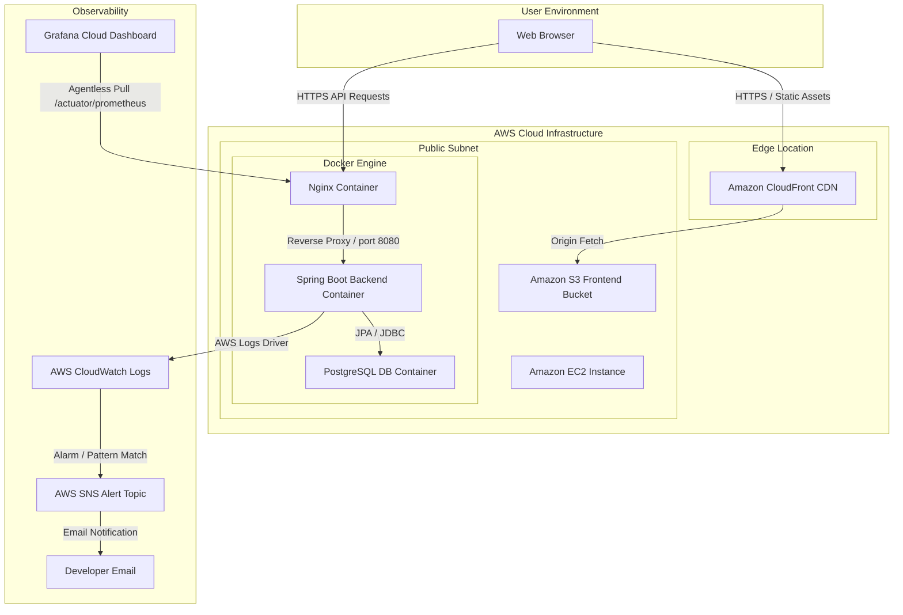
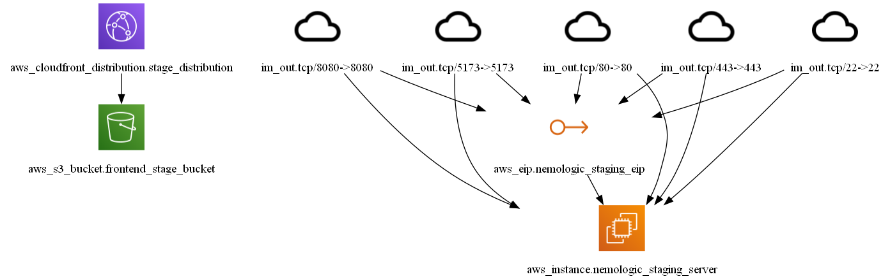
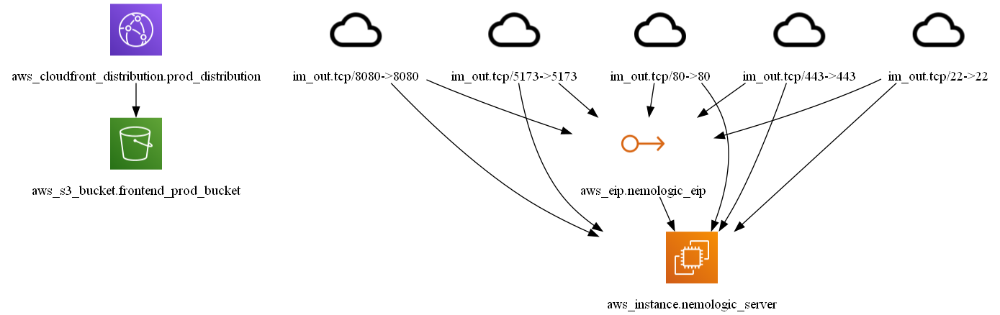
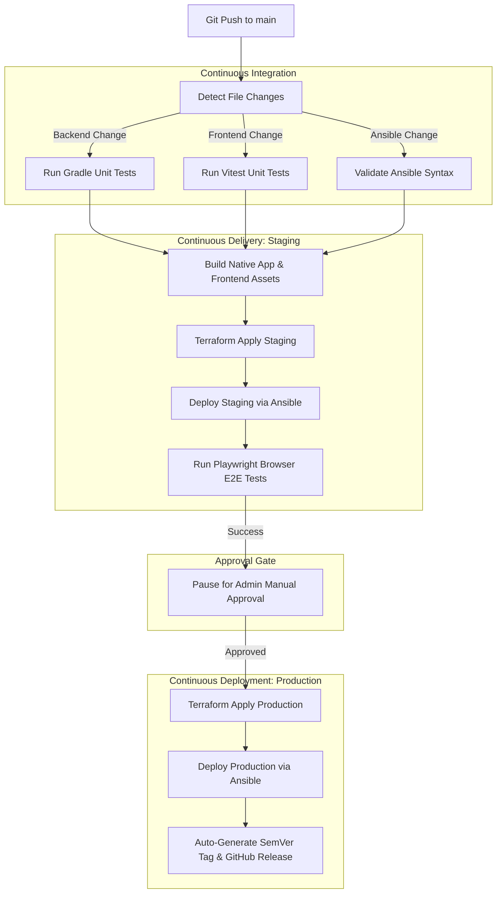

# rogic.io (Rotate Logic Nonogram Puzzle)

🚀 **Live Services**:
- **Production Environment**: [rogic.io](https://rogic.io)
- **Staging Environment**: [stage.rogic.io](https://stage.rogic.io)

`rogic.io` is a next-generation Nonogram logic puzzle platform that introduces 3D-like sub-grid rotation dynamics. Players align cognitive patterns, rotate sections of the grid, and solve puzzles to reveal hidden drawings.

This repository represents a fully production-grade, GitOps-driven full-stack application built with robust CI/CD automation, cloud infrastructure isolation, and telemetry metrics.

---

## 🛠 Technology Stack

| Category | Technologies | Description |
| :--- | :--- | :--- |
| **Frontend** | `Vue 3`, `TypeScript`, `HTML5 Canvas API`, `Axios` | Client app with decoupled pure TS game engine. |
| **Backend** | `Java 17`, `Spring Boot`, `Spring Data JPA` | REST API layer for stage state, history, and users. |
| **Database** | `PostgreSQL 16` | Relational storage for user logs, clear history, and stages. |
| **Infra & IaC** | `AWS`, `Terraform`, `Ansible`, `Docker Compose` | Code-defined AWS resources & automated config deployment. |
| **CI/CD** | `GitHub Actions`, `Vitest`, `Playwright` | Path-filtered tests, browser E2E validation, auto-SemVer. |
| **Telemetry** | `Prometheus`, `Grafana Cloud`, `CloudWatch` | Agentless scraping, log alarms, SNS email alerting. |

---

## 📐 System Architecture

The cloud hosting model utilizes strict subnetting and caching layers on AWS to deliver high availability and secure database isolation.



* **Frontend Hosting**: Static HTML/JS bundle compiled via Vite, hosted on `Amazon S3`, and distributed globally through `Amazon CloudFront` CDN with cache invalidation rules.
* **Backend API**: Packaged into Docker containers and run on a single `Amazon EC2` virtual host under `Nginx` reverse proxy, configured with Let's Encrypt SSL/TLS.
* **Telemetry**: Prometheus actuator endpoints are exposed securely via Nginx token authentication (`Authorization: Bearer`), allowing agentless metric scraping directly by Grafana Cloud.

<details>
<summary>🔍 Click to view Inframap Generated Resource Dependency Graphs</summary>

#### Staging Environment Infrastructure Graph


#### Production Environment Infrastructure Graph


</details>

---

## 🚀 CI/CD & GitOps Pipeline

The deployment pipeline ensures staging verification, automated QA gating, zero-downtime rollouts, and automatic version tagging.



### Key Workflow Characteristics:
1. **Path-Filtered Execution**: GitHub Actions evaluates directory diffs. Modifications to infrastructure files do not trigger Java compilation or NPM installs, saving developer waiting time.
2. **Playwright E2E Gating**: Upon deploying to Staging, a headless browser verifies the live endpoints (`stage.rogic.io`). It runs E2E user flows (anonymous sign-up, stage list fetching, canvas board rendering, profile stats loading) on the actual staging database.
3. **Manual Approval Gate**: Production deployments pause for admin approval. This gate is only revealed after staging E2E tests are 100% successful.
4. **Auto-SemVer Tagging & Release**: Successful production releases prompt the pipeline to automatically bump SemVer tags based on commit prefixes (`feat:`, `fix:`) and publish a GitHub Release with auto-generated change notes.

---

## 💡 Key Technical Highlights & Case Studies

### 1. Resource Optimization in micro-instances (512MB RAM)
> [!NOTE]
> Operating on AWS `t3a.nano` instances requires extreme resource discipline. To avoid out-of-memory (OOM) crashes and minimize costs, the following adjustments were implemented:

* **Swap Space Tuning**: Configured a `2.0 GB` swap file via Ansible to absorb memory spikes during rolling deployments.
* **Daily Garbage Collection**: Scheduled a nightly system cron tab:
  `docker system prune -af --volumes --filter "until=72h"`
  This automatically removes old docker images, cache, and unused containers, keeping the EBS disk footprint stable below 82% capacity.
* **Log Logging Clean-up**: Nginx access logs for metrics and health checks (`/actuator/*` and `/node-metrics`) were silenced (`access_log off;`). This saves disk I/O, keeps CloudWatch logs clean, and reduces AWS ingestion billing.

### 2. High Performance Canvas Engine (Decoupling Reactivity)
To ensure consistent 60 FPS rendering on the puzzle grid (especially for large 30x30 matrices), the game logic was decoupled from Vue's reactivity system.
* **Reactivity Proxy Overhead**: Vue wraps objects in `Proxy` handlers to watch changes. Evaluating 900+ cells inside proxy loops causes heavy CPU bottlenecks during high-frequency animations (e.g., cell hover, rotations).
* **Solution**: The canvas engine, coordinate states, and game logic were written as pure TypeScript classes. Vue components act solely as shell controllers that forward DOM events (mouse click/drag) directly to the Canvas element. 

### 3. Closed-Loop Telemetry & Email Alerts
Real-time monitoring is configured via Grafana Cloud and AWS CloudWatch:
* **JVM & DB Metrics Dashboard**: Tracks JVM Heap Memory, active/pending HikariCP DB connections, HTTP status codes, and RPS latency in real-time.
* **Error Log Alerts**: A CloudWatch Log Metric Filter monitors server output. When an `ERROR` level log or an HTTP 500 status code occurs in the live logs, a metric alarm is triggered.
* **SNS Notifications**: The CloudWatch alarm notifies an AWS SNS topic subscribed to the developer's email address, delivering instant crash alerts.

---

## 💻 Local Development Setup

To run `rogic.io` on your local workstation:

### Prerequisites
* Java 17 JDK
* Node.js 20+
* Docker & Docker Compose

### Step 1: Start PostgreSQL Database
```bash
# In project root
docker compose -f docker-compose.local.yml up -d db
```

### Step 2: Run Backend API
```bash
cd backend
./gradlew bootRun
```
* API Server will run on: `http://localhost:8080`

### Step 3: Run Frontend Client
```bash
cd frontend
npm install
npm run dev
```
* Frontend app will run on: `http://localhost:5173`
