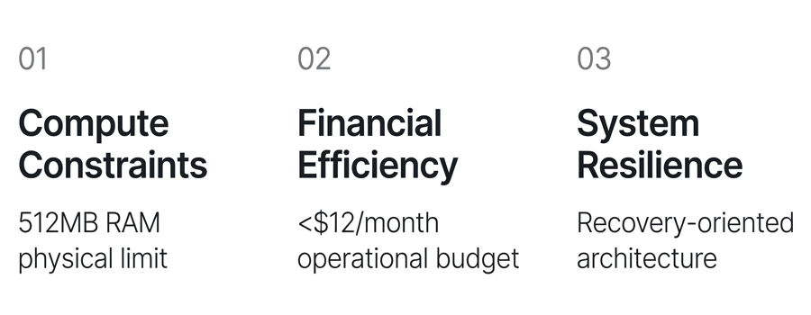
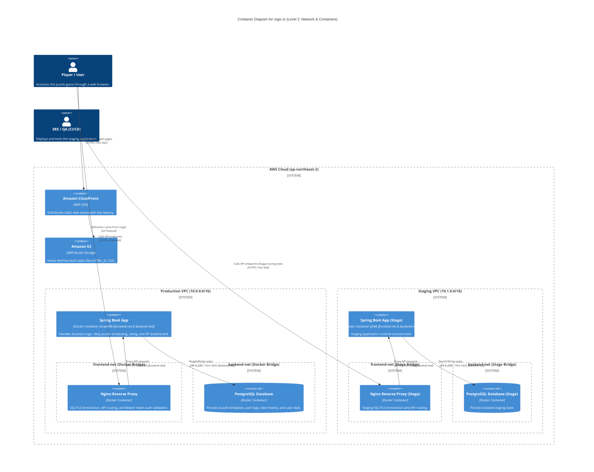
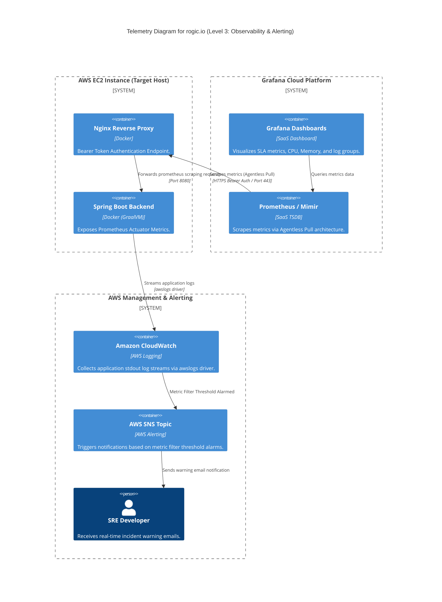
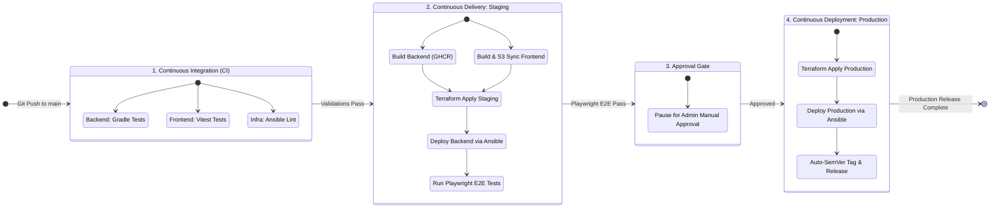

# rogic.io: Project Portfolio & Infrastructure

본 저장소는 `rogic.io` 프로젝트의 빌드 및 배포에 필요한 CI/CD 파이프라인, IaC 기반 인프라 구성 코드(Terraform/Ansible), 그리고 모니터링 환경의 구축 명세를 담고 있습니다.

## 0.1. Game Concept

`rogic.io`는 전통적인 사각형 격자판에서 퍼즐을 해결하는 네모로직(노노그램) 게임입니다. 단, 출제 시점에 임의의 각도로 회전된 퍼즐을 해결하면, 완료되는 순간 원래 방향으로 자동 회전 복원되며 완성된 패턴을 올바르게 보여주는 메커니즘을 내장하고 있습니다.

<p align="center">
  
</p>

## 0.2. Service Environments

| Service Environment | Live URL | Deployment Status |
| :--- | :--- | :--- |
| 🚀 **Production** | [rogic.io](https://rogic.io) |  |
| 🧪 **Staging** | [stage.rogic.io](https://stage.rogic.io) |  |

## 0.3. Technology Stack
| Category | Technologies |
| :--- | :--- |
| **Frontend** |    |
| **Backend** |   |
| **Database** |  |
| **Infra & IaC** |     |
| **CI/CD** |    |
| **Telemetry** |    |

## 0.4. Engineering Constraints & Principles
본 프로젝트는 초경량/초저가 인프라 환경에서 높은 시스템 안정성을 확보하기 위해 아래와 같은 3대 엔지니어링 제약 조건 및 극복 원칙을 수립하여 설계되었습니다.

<p align="center">
  
</p>

---

# 1. Infrastructure

## 1.1. System Architecture

### 1.1.1. High-Level Diagram


### 1.1.2. Component Specification
* **Frontend Static Hosting**<br>
  Vite 컴파일 결과물을 `Amazon S3` 버킷(OAC 차단)에 호스팅하고, `Amazon CloudFront` CDN을 통해 정적 웹 리소스를 배포합니다.
* **Backend API Gateway**<br>
  Spring Boot 애플리케이션을 단일 EC2 인스턴스 내 Docker 컨테이너로 가동하며, 프론트엔드 레벨에는 Nginx 리버스 프록시를 배치하여 `api.rogic.io` / `api.stage.rogic.io` 경로에 SSL/TLS 종단 처리를 수행합니다.
* **Telemetry Proxy**<br>
  지표 수집을 위해 호스트 내부 에이전트(Alloy) 설치를 배제하고 Nginx Bearer 토큰 검증 메커니즘을 적용해 메모리 점유율을 줄였습니다. 자세한 연동 메커니즘은 [1.5.1. Metric Collection & Scraping](#151-metric-collection--scraping)을 참고하십시오.

---

## 1.2. Cost Optimization
* **인프라 월간 운영 비용 분석 (Monthly Billing Summary)**<br>
  자원 다중화 및 관리형 DB 서비스 대신 가상 컨테이너 기술과 복구 지향형 설계를 연동하여 월 $11.45 (세후 실청구액 기준, 기존 대비 약 80% 비용 절감)의 상용 인프라 운영을 달성했습니다.

  | 구분 (Category) | 기존 구성 예상 비용 (Estimated) | 최적화 구성 실제 비용 (2026년 6월) | 주요 비고 (Key Notes) |
  | :--- | :--- | :--- | :--- |
  | **컴퓨팅 및 스토리지** | $20.00 / 월 (t3.micro) | $5.50 / 월 (t3a.nano + EBS) | GraalVM 네이티브 컨테이너화를 통해 메모리 스레싱 극복 |
  | **로드 밸런서** | $20.00 / 월 (AWS ALB) | $0.00 / 월 (Self-hosted Nginx) | ALB 제거 후 Route 53 고정 EIP 다이렉트 매핑 |
  | **데이터베이스** | $15.00 / 월 (RDS PostgreSQL) | $0.00 / 월 (PostgreSQL Container) | EC2 호스트 내부 Docker Compose 환경 가동 |
  | **네트워크 & 도메인** | N/A *1 | $4.74 / 월 (IP 주소 + Route 53) | 퍼블릭 IPv4 사용료 ($3.70) + 호스팅 영역 ($1.04) |
  | **기타 (데이터 전송 등)** | N/A *1 | $1.21 / 월 | 데이터 트래픽 전송 및 유틸리티 자원 비용 |
  | **합계 (Total)** | **약 $55.00 / 월** | **총 $11.45 / 월** | **기존 대비 약 80% 비용 절감 달성 (세후 실청구액)** |

  *1: 기존 구성 단계에서 산출되지 않은 네트워크 유지 및 도메인 고정 비용입니다.

### 1.2.1. Compute Resource Downsizing
* **t3a.nano/t4g.nano (512MB RAM) 타겟팅**<br>
  월 $3.5 대 컴퓨팅 인스턴스 사양에 맞추어 리소스를 튜닝했습니다.
* **GraalVM Native Image 메모리 최적화**<br>
  Spring Boot 애플리케이션의 런타임 메모리 점유율을 30MB 이하로 낮추어 초경량 인스턴스 사양에 부합하도록 튜닝했습니다. 자세한 리플렉션 힌트 및 Native 빌드 상세 내역은 [1.6.1. Host Memory Exhaustion Incident](#161-host-memory-exhaustion-incident)를 참고하십시오.
* **Jackson 역직렬화 DTO Reflection 힌트**<br>
  Native 빌드 오류 방지를 위해 [NemologicRuntimeHints.java](backend/src/main/java/com/devdoyen/nemologic/config/NemologicRuntimeHints.java)에 리플렉션 힌트를 명시했습니다.
* **Docker Garbage Collection 자동화**<br>
  디스크 용량 고갈 장애 예방을 위해 새벽 3시마다 72시간 경과 도커 리소스를 강제 소거하는 prune 스크립트를 크론탭으로 자동 배치했습니다.

### 1.2.2. Load Balancer Elimination
* **ALB 제거 및 고정 EIP 구성**<br>
  월 $20 상당의 AWS ALB를 배제하고 DNS 도메인(Route 53)과 고정 Elastic IP를 매핑했습니다. SPOF와 자동 복구 관련 상세 완화 대책은 [1.3.2. Single Point of Failure (SPOF)](#132-single-point-of-failure-spof) 및 [1.3.3. Recovery Indicators](#133-recovery-indicators)를 참고하십시오.
* **EC2 Auto Recovery 및 복구 지향 아키텍처(ROA)**<br>
  ALB 부재에 따른 장애 전파를 줄이기 위해 시스템 알람 연동 호스트 자동 복구(Auto Recovery)를 결합하고, 재해 복구 시 IaC 코드를 활용해 5분 이내 인프라를 복원하도록 구성했습니다.

### 1.2.3. Database Cost Minimization
* **Self-hosted PostgreSQL 컨테이너**<br>
  월 $15~20 이상의 RDS 비용을 아끼기 위해 EC2에 DB 컨테이너를 기동했습니다.
* **S3 정기 백업 및 Lifecycle 제어**<br>
  6시간 주기로 DB dump 데이터를 S3로 업로드하는 쉘 스크립과 Cron을 배포하고, S3 백업 버킷에 30일 경과 백업 자동 파기 정책을 적용했습니다.

### 1.2.4. Staging Resource Stop/Start Scheduling
* **Staging 인스턴스 평시 정지**<br>
  개발/검증 환경인 Staging EC2 인스턴스는 불필요한 컴퓨팅 비용 낭비를 막기 위해 평시에 중지(Stopped) 상태를 유지합니다.
* **CI/CD 파이프라인 연동 기동**<br>
  GitHub Actions 워크플로우 실행 시 `deploy-staging` 작업 내에서 AWS CLI를 통해 인스턴스를 자동으로 기동(Start)하고, 배포 및 검증(Playwright E2E)을 마친 뒤 별도의 스케줄 및 정책을 통해 비용 효율성을 극대화합니다.

---

## 1.3. Technical Trade-offs
비용 최적화를 달성하기 위해 포기한 기술적 혜택(Trade-offs)과 이를 극복하기 위해 설계한 완화 대책(Mitigations)을 명시적으로 투명하게 공개합니다.

### 1.3.1. Build Resource Constraints
* **물리 메모리 고갈에 따른 컴파일 리스크 (Trade-off)**<br>
  t3a.nano(512MB RAM) 환경에서는 메모리 제약으로 인해 서버 내에서 직접 GraalVM 컴파일 빌드가 불가능하며, 빌드 속도 또한 JVM 컴파일에 비해 10배 이상 오래 소요됩니다.
* **외부 컴퓨팅 오프로딩 (Mitigation)**<br>
  CI/CD 파이프라인에서 GitHub Actions가 제공하는 외부 빌드 인프라(2 Core, 7GB RAM)에 컴파일 연산 부하를 위임하고, 운영 서버 호스트는 30MB 수준의 무부하 바이너리 구동만 전담하도록 분리 구조화했습니다.

### 1.3.2. Single Point of Failure (SPOF)
* **다중 AZ 로드밸런싱 포기 (Trade-off)**<br>
  AWS Load Balancer(ALB) 배제로 인해 다중 가용구역(Multi-AZ) 무중단 이중화 및 롤링 배포를 달성할 수 없으며, 호스트 물리 장애 시 전체 정전이 발생하는 단일 장애점(SPOF)을 노출하게 됩니다.
* **호스트 자동 복구 결합 (Mitigation)**<br>
  AWS CloudWatch Status Check Metric Alarms를 결합해 물리 하드웨어 결함 발생 시 1분 이내에 인스턴스를 정상 물리 호스트로 자동 복원(Auto Recovery)하여 EIP를 바인딩하도록 인프라 복원력을 강화했습니다.

### 1.3.3. Recovery Indicators
* **관리형 DB Failover 및 시점 복구 상실 (Trade-off)**<br>
  AWS RDS의 완전관리형 이중화 복구 및 시점 복구(PITR) 편의성을 상실하였으며, 재해 복구 시 백업 덤프 파일 기반의 수동 복원 처리가 요구됨에 따라 RPO가 최대 6시간(백업 주기), RTO가 약 20분 수준으로 하향 조정됩니다.
* **복구 지향 아키텍처(ROA) 구현 (Mitigation)**<br>
  인프라를 코드로 구성(Terraform/Ansible)하여 재설치 과정을 자동화하고, 6시간 주기 백업 덤프 자산을 독립 버킷 S3에 안전하게 보관하여 전체 데이터 유실 및 가상 머신 소멸 시에도 5분 이내 수동 복구 가능한 절차를 수립했습니다.

---

## 1.4. Security Infrastructure

### 1.4.1. Network Isolation


* **물리 격리형 VPC 구성**<br>
  Staging VPC(`10.1.0.0/16`)와 Production VPC(`10.0.0.0/16`)를 개별 서브넷 대역과 독립 인프라망으로 분리 프로비저닝하여 상호 간의 간섭을 완전히 격리했습니다.
* **다계층 도커 브리지 네트워크 격리**<br>
  단일 EC2 내부 통신 시 인터넷 개방점인 Nginx(`frontend-net`)가 DB(`backend-net`)에 직접 접근할 수 없도록 가상 네트워크를 분리하고, 백엔드 API 컨테이너가 가교 역할을 전담하게 하여 횡적 이동(Lateral Movement) 위협을 제한했습니다.
* **Database Outbound 차단 (`internal: true`)**<br>
  데이터베이스가 상주하는 `backend-net` 브리지망에 `internal: true`를 지정하여 인터넷 아웃바운드를 완전 봉쇄함으로써 RCE 침투 시 리버스 커넥션 수립 및 데이터 무단 유출(Exfiltration) 시도를 원천 차단했습니다.
* **보안 로드맵 (Security Roadmap)**<br>
  향후 컨테이너 내부 애플리케이션의 Non-root User 실행 권한 전환 및 Read-Only root 파일시스템 제한을 적용하여 컨테이너 샌드박스 보안을 더욱 강화할 예정입니다. DB 백업은 호스트 단의 표준 출력 파이프라인(`docker exec pg_dump`)으로 중재 처리하므로 기능적 장애가 없습니다.

### 1.4.2. Host Access Control
* **SSM Session Manager 및 SSH(22) 포트 완전 차단**<br>
  EC2 호스트 터미널 접근 경로의 무작위 대입 공격과 SSH 키 유출 리스크를 제거하기 위해 인바운드 보안 그룹에서 SSH(22) 포트를 완전히 차단했습니다. 외부 직접 접속은 거부하고 IAM 자격 증명 기반의 AWS System Manager 세션을 경유해서만 터미널 접근이 가능하도록 구성했습니다.
* **SSM 터널 캡슐화를 통한 Ansible SSH 인증**<br>
  인스턴스의 인바운드 22포트를 막아두는 대신, 로컬 및 러너 환경의 `aws ssm start-session` 프록시 명령(`ProxyCommand`)을 SSH 터널로 삼아 캡슐화했습니다. 이 터널 내부에서 기존 SSH 인증 키(PEM)를 활용한 2차 인증을 거치도록 구성하여 Ansible Playbook을 통한 무작위 SSH 노출 리스크를 차단하고 안전하게 호스트를 관리합니다.

#### 1.4.2.1. Security Group Configuration
* **Inbound (Ingress) Rules & Port Control**<br>
  본 프로젝트에서는 Staging 및 Production 환경 모두 외부 서비스 및 모니터링 연동을 위한 Nginx 포트(80, 443)만 인바운드로 최소 허용합니다. 그 외 SSH(22), Spring Boot API(8080), Vite Frontend 개발(5173) 포트는 보안 그룹 규칙에서 완전히 배제되어 인터넷 직접 노출이 불가능합니다.

  | 허용 포트 (Port) | 프로토콜 (Protocol) | 소스 (Source) | 목적 및 대상 서비스 |
  | :---: | :---: | :---: | :--- |
  | 80 | TCP | `0.0.0.0/0` | Nginx HTTP 웹 서버 (HTTPS 301 리다이렉트용) |
  | 443 | TCP | `0.0.0.0/0` | Nginx HTTPS 보안 웹 서비스 및 API 통신 (모니터링 스크래핑 포함) |

* **Telemetry Scraping Proxy**<br>
  Grafana Cloud Mimir의 원격 프로메테우스 수집기(Prometheus Pull)가 지표를 수집할 때도 외부 8080 포트 직접 접근을 금지합니다. 수집기는 Nginx HTTPS(443)로 요청을 전송하며, Nginx 단에서 Bearer 토큰 보안 검증을 통과한 통신에 한해 로컬 루프백망의 Spring Boot Actuator(/actuator/prometheus)로 프록시 중재하도록 설계되어 안전성을 보장합니다.

* **Outbound (Egress) Rules**<br>
  | 허용 포트 (Port) | 프로토콜 (Protocol) | 대상 (Destination) | 비고 |
  | :---: | :---: | :---: | :--- |
  | All | All | `0.0.0.0/0` | 패키지 업데이트, 외부 API 호출 및 DB 백업 S3 업로드용 |

#### 1.4.2.2. IAM Least Privilege Design
EC2 호스트 및 CI/CD 파이프라인 각각의 실행 주체별로 실제 적용된 IAM 권한과 인증 메커니즘을 명시하여 보안 정합성을 보장합니다.

| 주체 (Principal) | 인증 방식 (Auth Type) | 연결된 IAM 정책 및 권한 (IAM Policies) | 주요 역할 및 비고 (Key Role) |
| :--- | :--- | :--- | :--- |
| **EC2 Host Role** | Instance Profile | `AmazonSSMManagedInstanceCore`<br>Staging: `CloudWatchAgentServerPolicy` (관리형)<br>Production: `nemologic-cloudwatch-log-policy` (커스텀)<br>`s3_backup_policy` (커스텀) | SSM 터널링 활성화, CloudWatch 로그 실시간 포워딩(Staging/Production 별 정책 차등 적용), DB 백업 S3 업로드 권한 제어 |
| **CI/CD Runner (GitHub)** | AWS OIDC (Keyless) | `nemologic-staging-github-policy`<br>`nemologic-production-github-policy` (커스텀) | `sts:AssumeRoleWithWebIdentity`를 통해 GitHub Actions OIDC 토큰으로 1회용 단기 자격 증명을 획득하여 Terraform 및 배포 수행 (Secret Key 하드코딩 배제 및 최소 권한 수립) |

* **OIDC Keyless Authentication**<br>
  하드코딩된 AWS API Access Key 사용을 지양하고, GitHub OIDC(OpenID Connect) 연동을 수립하여 매 빌드 및 배포 시점에 AWS Security Token Service(STS)로부터 1회용 단기 자격 증명을 획득(AssumeRole)합니다. 이로써 자격 증명 유출 경로를 원천 차단하고 보안 안전성을 확보했습니다.

* **Service-Level Least Privilege Policy**<br>
  테라폼 및 Ansible 배포 범위에 정확히 부합하는 서비스 수준 최소 권한 정책(Staging/Production 별 커스텀 IAM Policy)을 바인딩했습니다. 이를 통해 허용 서비스 이외의 타 서비스 자원(예: RDS, Lambda, KMS 등) 관리를 원천 차단하여 Least Privilege 통제를 완결했습니다.

  | 대상 서비스 (Service) | 허용 작업 (Actions) | 대상 리소스 범위 (Resource Constraints) | 사용 목적 및 용도 (Purpose) |
  | :--- | :--- | :--- | :--- |
  | **EC2 / VPC** | `ec2:*` | `*` (Wildcard) | VPC, 서브넷, Route Table, Internet Gateway, 보안 그룹, 인스턴스 및 EIP 생성/관리 |
  | **S3 Storage** | `s3:*` | `arn:aws:s3:::nemologic-*`<br>`arn:aws:s3:::rogic-*` | 테라폼 상태 파일(State), 데이터베이스 백업 버킷 관리 및 프론트엔드 정적 파일 배포 동기화 |
  | **DynamoDB** | `dynamodb:*` | `arn:aws:dynamodb:*:*:table/nemologic-tfstate-lock` | 테라폼 상태 파일의 동시 수정 충돌을 예방하기 위한 원격 상태 잠금(Locking) 제어 |
  | **IAM** | `iam:*` | `arn:aws:iam::*:role/nemologic-*`<br>`arn:aws:iam::*:policy/nemologic-*`<br>`arn:aws:iam::*:instance-profile/nemologic-*`<br>`arn:aws:iam::*:oidc-provider/token.actions.githubusercontent.com` | EC2 IAM 역할/인스턴스 프로필 프로비저닝 및 OIDC Runner 역할 자체의 AssumeRole 정책 제어 |
  | **CloudWatch Logs** | `logs:*` | `*` (Wildcard) | 호스트 내부 시스템 및 애플리케이션 로그 그룹 생성, 수명주기 조회 및 스트림 수집 관리 |
  | **CloudWatch Alarms** | `cloudwatch:*` | `arn:aws:cloudwatch:*:*:alarm:nemologic-*` | 시스템 하드웨어 장애(Status Check Failed) 감지 시 호스트 자동 복구(Auto Recovery) 트리거 |
  | **SNS Alerts** | `sns:*` | `arn:aws:sns:*:*:nemologic-*` | 장애/경고 상황 발생 시 시스템 관리자 이메일 수신을 위한 알림 토픽 및 구독(Subscription) 관리 |
  | **SSM** | `ssm:*` | `*` (Wildcard) | Ansible Playbook 가동 시 22번 포트 외부 노출을 방지하기 위한 SSM Session Manager 터널링 연결 |
  | **CloudFront (CDN)** | `cloudfront:*` | `*` (Wildcard) | 정적 자산 배포용 CDN 배포판 정보 조회 및 신규 버전 배포 시 엣지 캐시 무효화(Invalidation) 실행 |
  | **ACM Certificate** | `acm:*` | `*` (Wildcard) | HTTPS 적용을 위한 SSL/TLS 인증서 검증 및 CloudFront 연결 전용 us-east-1 인증서 조회 |
  | **Route 53 (DNS)** | `route53:*` | `*` (Wildcard) | 퍼블릭 도메인(`rogic.io`, `stage.rogic.io`) 매핑 및 네임서버 DNS 레코드셋 생성/조정 제어 |

#### 1.4.2.3. Ansible SSM Tunneling Specification
Ansible이 SSH 22 포트가 막힌 호스트에 접근할 때 활용하는 `hosts.ini` 내 ProxyCommand 연결 아키텍처 스키마입니다.

```ini
[nemologic_servers]
nemologic-app-server ansible_host=<EC2_Instance_ID> ansible_user=ubuntu ansible_ssh_private_key_file=<PEM_File_Path> ansible_ssh_common_args='-o ProxyCommand="aws ssm start-session --target %h --document-name AWS-StartSSHSession --parameters portNumber=%p"'
```

### 1.4.3. SSL/TLS Certificate Management
* **Let's Encrypt 및 Certbot 갱신**<br>
  HTTPS(443) 통신 및 HTTP(80) 301 리다이렉트 정책을 구현하였으며, 3개월 만료 인증서 자동 갱신을 지원하는 pre/post 쉘 스크립트 훅을 Certbot 데몬에 바인딩했습니다.

### 1.4.4. State Management Security
* **테라폼 원격 상태 잠금**<br>
  AWS S3 버킷과 DynamoDB 테이블(`LockID`)을 Backend로 연동해 개발자 배포 시 형상 관리(State)의 동시 수정 충돌을 원천 방지했습니다.

---

## 1.5. Observability

### 1.5.1. Metric Collection & Scraping


* **Agentless Pull 아키텍처**<br>
  호스트 리소스를 소모하는 수집기(Alloy) 대신, Nginx 프록시가 `Authorization: Bearer` 헤더 토큰을 대조 검증하는 가상 경로를 열고 외부 Grafana Cloud Mimir가 직접 긁어가도록 구조화했습니다.

### 1.5.2. Centralized Log Management
* **awslogs Docker 드라이버 연동**<br>
  컨테이너 출력을 AWS CloudWatch Logs(`/aws/ec2/nemologic`)로 실시간 포워딩하여 디스크 점유율을 줄였으며, 헬스체크 및 메트릭 수집 API 경로는 Nginx Access Log에서 제외(off) 처리했습니다.

### 1.5.3. Alerting & Notification
* **장애 감지 경보 연동**<br>
  CloudWatch Logs Metric Filter 오류 발생 시 AWS SNS를 경유해 개발자 메일로 상황이 실시간 통보되며, 도쿄·싱가포르·시드니 리전에서 동시에 `/actuator/health` 헬스체크 실패가 감지되면 Grafana 경보가 트리거됩니다.

### 1.5.4. SLO Visualization
* **통합 관제 SLA 대시보드 ([current_dashboard.json](infra/monitoring/current_dashboard.json))**<br>
  SRE 핵심 품질 지표(Uptime SLA, Incident Count, MTTR, MTBF)를 Grafana 전역 시간 범위(Time Range Picker)에 동적으로 연동되도록 설계하여 단일 행 4열 KPI 카드 레이아웃에 맞춰 배치했습니다.
* **[Grafana Live Public Dashboard](https://grandwalrus3189.grafana.net/public-dashboards/ec9e06b0d1ea4540b97af6b56abb1380)**<br>
  레이아웃 구성 예시용 퍼블릭 링크 (인프라 보안 정책 준수를 위해 민감한 라이브 메트릭 대신 데모용 샘플 메트릭이 시각화됩니다.)

#### 1.5.4.1. PromQL Query Formulation
> [!NOTE]
> 수식 내 기호 정의: $P_t \in \{0, 1\}$는 특정 측정 시점 $t$의 API 헬스체크 가용 성공 여부(`probe_success`)를 의미합니다. 초기 수집 시점에 가용 상태가 0(장애)으로 시작하는 경우, 첫 번째 변화(0 → 1)가 장애 복구임에도 홀수 변화 횟수가 반환되어 나눗셈 결과에 소수점이 발생할 수 있으므로 쿼리에서는 정수 나눗셈(내림) 처리를 적용합니다.

* **API Health Status**

$$\text{API Health} = \sum P_t$$

```promql
sum(probe_success{job="nemologic-api-health", instance="https://rogic.io/actuator/health"})
```

* **Dynamic Service Availability**

$$\text{Availability (\%)} = \text{avg}_{t \in \text{range}}(P_t) \times 100$$

```promql
avg_over_time(probe_success{job="nemologic-api-health", instance="https://rogic.io/actuator/health"}[$__range]) * 100
```

* **Dynamic Incident Count**

$$\text{Incident Count} = \left\lfloor \frac{\text{changes}(P_t)}{2} \right\rfloor$$

```promql
floor(changes(probe_success{job="nemologic-api-health", instance="https://rogic.io/actuator/health"}[$__range]) / 2)
```

* **Dynamic MTTR (Mean Time To Recovery)**

$$\text{MTTR (sec)} = \frac{\left(\text{count}_{t \in \text{range}}(P_t) - \sum_{t \in \text{range}} P_t\right) \times 60}{\text{clamp}_{\text{min}}\left(\frac{\text{changes}(P_t)}{2}, 1\right)}$$

```promql
((count_over_time(probe_success{job="nemologic-api-health", instance="https://rogic.io/actuator/health"}[$__range]) - sum_over_time(probe_success{job="nemologic-api-health", instance="https://rogic.io/actuator/health"}[$__range])) * 60) / clamp_min(changes(probe_success{job="nemologic-api-health", instance="https://rogic.io/actuator/health"}[$__range]) / 2, 1)
```

* **Dynamic MTBF (Mean Time Between Failures)**

$$\text{MTBF (sec)} = \frac{\sum_{t \in \text{range}} P_t \times 60}{\text{clamp}_{\text{min}}\left(\frac{\text{changes}(P_t)}{2}, 1\right)}$$

```promql
(sum_over_time(probe_success{job="nemologic-api-health", instance="https://rogic.io/actuator/health"}[$__range]) * 60) / clamp_min(changes(probe_success{job="nemologic-api-health", instance="https://rogic.io/actuator/health"}[$__range]) / 2, 1)
```

* $\text{clamp}_{\text{min}}(x, d) = \max(x, d)$을 의미하며, 측정 대상 기간 중 장애/복구 전환 이벤트가 0회 발생할 경우 발생하는 분모 0 오류(Zero-division) 방지를 위해 PromQL 함수로 보정한 것입니다.

#### 1.5.4.2. Target Service Level Indicators
본 프로젝트는 단일 EC2 인스턴스 및 도커 가상화 환경의 물리적 제약 조건 하에, 아래와 같은 가용성 및 재해 복구 최대 허용 한계 목표(SLA/SLO Target)를 수립하여 모니터링합니다.

| 서비스 수준 지표 (SLI) | 최대 허용 한계 목표 (Target Constraints / SLA) | 비고 및 설계 근거 (Design Rationale) |
| :--- | :--- | :--- |
| **Availability (가용성)** | **99.0%** (월간 누적 장애 약 7.3시간 이내) | 단일 EC2 사양에 따른 AWS 하드웨어 물리 가용 한계치 감안 |
| **RPO (복구 시점 목표)** | **최대 6시간** (장애 시 최대 6시간치 데이터 유실 허용) | 6시간 주기의 S3 백업 덤프 자산 소산 주기 기준 |
| **RTO (복구 시간 목표)** | **최대 20분** (재해 선언 후 20분 이내 서비스 정상화) | IaC 코드 기반 EC2 인프라 재구축 및 DB 덤프 복원 소요 시간 |
| **MTBF (평균 고장 간격)** | **720시간 (30일)** 이상 무장애 지속 | 스왑 가상 메모리 구성 및 도커 가비지 컬렉션 자동화를 통한 리소스 방어 |
| **MTTR (평균 복구 시간)** | **10분 이내** (장애 전파 감지 후 정상화) | AWS Auto Recovery 호스트 복구 및 백업 수동 복원 절차 수립 |

---

## 1.6. Troubleshooting

### 1.6.1. Host Memory Exhaustion Incident
* **배경**<br>
  인프라 비용 극 최소화(월 $11.45 구성)를 위해 t3a.nano 인스턴스(512MB RAM) 환경을 선택하였으나, 모니터링 수집 에이전트(Grafana Alloy)의 메모리 점유(100MB+)와 블루/그린 배포 시점에 Spring Boot 컨테이너 2개가 일시적으로 동시에 기동하면서 물리 메모리 한계를 초과하여 OOM 및 CPU 스레싱 장애가 빈번히 발생함.
* **해결 방안**<br>
  - **Agentless Pull 아키텍처 도입**<br>
    호스트 리소스를 차지하는 수집 데몬(Alloy)을 배제. 대신 Nginx 리버스 프록시 단에서 Spring Actuator 메트릭 엔드포인트를 Bearer 토큰 보안 검증 하에 외부 노출하고, Grafana Cloud Prometheus가 원격으로 Pull(Scraping)하게 전환하여 모니터링 에이전트 구동에 따른 메모리 점유를 제거함.
  - **GraalVM Native Image 고도화**<br>
    빌드 타임 AOT 컴파일 및 Jackson 리플렉션 힌트 지정을 통해 Spring Boot 컨테이너 런타임 메모리 풋프린트를 기존 250MB+에서 **30MB 이하**로 극소화하여, 512MB RAM의 가혹한 물리 환경에서도 2개 컨테이너 무중단 교체 가용성을 안정적으로 유지함.
* **기술적 교훈 및 의사결정 (Retrospective)**<br>
  초기 검토 시 범용 권장 사안인 인스턴스 스케일업(t3.micro 이상)이나 AWS ALB/RDS 관리형 서비스 도입을 권장받았으나, **프로젝트 예산 극 최소화**라는 제약 조건을 충족하기 위해 시스템 레벨 최적화를 고수했습니다. 결과적으로 메트릭 수집 방식을 Push에서 Pull로 스위칭하고 GraalVM Native AOT 컴파일 풋프린트를 30MB 이하로 튜닝함으로써, 추가 인프라 지출 없이 물리 한계를 극복하고 저사양 컴퓨팅 환경에서도 이중화 배포 정합성을 확보했습니다.

---

# 2. CI/CD

## 2.1. Pipeline Workflow

### 2.1.1. GitOps Flowchart


### 2.1.2. Pipeline Trigger Optimization
* **경로 필터(Path Filtering)**<br>
  단순 문서나 로컬 마크다운 수정 커밋 유입 시에는 빌드/컴파일 단계를 스킵하여 배포 속도를 최적화했습니다.
* **배포 대기 취소(Concurrency)**<br>
  Staging 진행 중 추가 커밋이 유입되는 즉시 이전 배포 작업을 강제 취소(`cancel-in-progress: true`)해 배포의 꼬임 현상을 방지했습니다.

---

## 2.2. Artifact Management

### 2.2.1. Compute Offloading
* **Actions Runner 컴파일 오프로딩**<br>
  512MB 호스트 내부의 빌드 제약을 극복하기 위해 빌드 연산 부하를 GitHub Actions로 오프로딩했습니다. 상세 완화 구조는 [1.3.1. Build Resource Constraints](#131-build-resource-constraints)를 참고하십시오.

### 2.2.2. Static Asset Delivery
* **Vite Static Asset 동적 업로드**<br>
  프론트엔드는 도커 이미지 생성 대신 컴파일된 정적 자산(index.html, JS 번들)을 S3 버킷으로 다이렉트 동기화(`aws s3 sync`)하고 CloudFront Edge 무효화(Invalidation)를 호출하는 초경량 정적 호스팅 배포 방식을 수립했습니다.

---

## 2.3. Release Automation

### 2.3.1. Automated End-to-End Testing
* **Playwright E2E 테스트**<br>
  Staging 배포 완료 즉시 Playwright 브라우저(`frontend/e2e/staging.spec.ts`)를 헤드리스 기동하여 홈 화면 로딩, 캔버스 노노그램 상호작용 및 익명 가입 로직을 실제 유저 브라우저 환경에서 자동 점검해 품질 게이트를 가동합니다.

### 2.3.2. Deployment Gate & Approvals
* **수동 승인 배포(Manual Gate)**<br>
  Staging 테스트가 100% 성공하면 빌드를 일시 정지시키고 관리자가 직접 GitHub Environment 상에서 릴리즈를 검증/승인해야만 Production으로 롤링 배포를 승격시키는 안전 장치를 구성했습니다.

### 2.3.3. Automated Versioning
* **Auto-SemVer 및 Release 자동 작성**<br>
  커밋 메시지 토큰(`feat:`, `fix:`) 규격을 파싱해 SemVer 버전을 갱신하고, 변경 이력(Changelog) 작성과 GitHub Release 릴리즈 발행 과정을 100% 자동화했습니다.

---

## 2.4. Troubleshooting

### 2.4.1. Deployment Pipeline Conflict
* **배경**<br>
  - Staging과 Production 인프라 설정이 동일 Terraform 코드에 묶여 일괄 반영되던 중, 운영 환경 S3 버킷에 정적 자산이 시딩되지 않은 상태에서 DNS A 레코드가 CloudFront/S3로 먼저 스위칭되어 운영 전체 접속 차단(`AccessDenied`) 장애 발생 ([Access Failure Report](./docs/incidents/20260630_production_access_failure.md)).
  - 핫픽스 도중 GitHub Actions의 `cancel-in-progress: true` 설정으로 인해 Nginx 인증서 발급 프로세스 도중 후속 커밋이 이전 빌드를 강제 취소하면서 실서버 SSL 인증서 유실로 인한 HTTPS API 통신 불능 장애 발생 ([Handshake Failure Report](./docs/incidents/20260630_production_api_handshake_failure.md)).
* **해결 방안**<br>
  - **인프라 환경 물리 격리**<br>
    Terraform Workspace 및 디렉토리 구조를 Staging과 Production으로 엄격히 분할하여 단일 실행이 실 운영계에 즉각 영향을 미치지 않도록 조치.
  - **중요 배포 동시성 차단 옵션 제거**<br>
    중요 서버 설정 배포 단계(`deploy-production`)에서 `cancel-in-progress: false`를 명시하여 이전 작업이 중도 파기되는 설정 정합성 훼손을 원천 차단.
  - **배포 단계의 느슨한 결합(Loose Coupling)**<br>
    CloudFront TLS 및 SSL 인증서 교체 등의 상호 의존적인 작업들이 실제 서버 준비 상태를 검증한 후에 이루어지도록 수동 승인 게이트(Manual Approval Gate)를 도입해 인프라 프로모션 방식을 개선함.

---

# 3. AI Engineering

## 3.1. AI Puzzle Pipeline
* **자동 생성 스케줄러**<br>
  새벽 04:17마다 `gemini-3.1-flash-lite` LLM API를 호출하여 신규 퍼즐 레이아웃을 생성하며, API Rate Limit 방어를 위해 5초의 지연 간격과 3회의 재시도 장치를 백엔드에 장착했습니다.
* **논리해 자동 검증**<br>
  AI가 생성한 퍼즐 중 단순 찍기로 풀 수 있는 오출제 건을 필터링하기 위해, Java 백엔드 단에 DFS 백트래킹 기반의 `isLogicalOnly(grid)` 추론 검증 알고리즘을 이식하여 무결성 품질 가드레일을 구축했습니다.

---

## 3.2. AI Governance
* **피드백 루프**<br>
  유저의 평점(👍/👎) 피드백 카드가 DB `stages` 테이블에 기록되며, 백오피스 대시보드에서 평점 현황을 식별할 수 있습니다.
* **수동 강제 삭제**<br>
  품질 미달이나 기형적인 퍼즐로 판단되면, 관리자가 백오피스 대시보드에서 연쇄 삭제(Cascading Delete)를 통해 즉각 Hard Delete할 수 있는 관리 장치를 도입했습니다.
* **에이전트 거버넌스 규칙 (.agents/rules/)**<br>
  AI 코딩 에이전트와 협업하여 지속 가능한 리스크 관리 및 고신뢰성 코딩 컨벤션을 준수하기 위해 정의된 파일 목록입니다:

  | 규칙 파일 | 주요 관리 목적 및 정책 요약 | 형상 추적 여부 |
  | :--- | :--- | :--- |
  | [architecture-and-tech-stack.md](.agents/rules/architecture-and-tech-stack.md) | 프론트/백엔드/인프라 레이어의 다중 동시 수정 차단, Vue Reactivity 논리 유출 방지, 순차 배포 준수 | `Git Tracked` |
  | [documentation-guidelines.md](.agents/rules/documentation-guidelines.md) | 상대경로(file:// 금지) 사용, 마크다운 개행 규정 준수, 비교 수치 데이터 기술 시 테이블(Table) 시각화 의무화 | `Git Tracked` |
  | [git-and-commit-guidelines.md](.agents/rules/git-and-commit-guidelines.md) | Conventional Commits 규칙 준수, 로컬 커밋 자동 보존 및 원격 push 개발자 위임 | `Git Tracked (Force Added)` |
  | [workflow-and-tdd.md](.agents/rules/workflow-and-tdd.md) | 코어 로직 작성 시 TDD(Test-Driven Development) 선행 의무화 및 progress_state.md 수시 동기화 | `Git Tracked` |
  | [safety-and-communication.md](.agents/rules/safety-and-communication.md) | 요구사항이 모호한 경우 임의 구현(No Guessing)을 중단하고 개발자 승인 대기 | `Git Tracked` |
  | [incident-reporting.md](.agents/rules/incident-reporting.md) | 장애 리포트 작성 시 3W1H 사상에 근거한 구체적 원인-결과 수치 명세 및 포스트모템 구조화 | `Git Tracked` |

---

## 3.3. Troubleshooting

### 3.3.1. AI Generation Parsing Incident
* **배경**<br>
  초경량 LLM 모델이 30x30 대형 그리드 생성 시 응답 지연을 아끼기 위해 JSON 포맷 대신 `Array(30).fill(0)` 같은 JS 문법을 변형 반환하여 백엔드 Jackson 역직렬화 오류(`JsonParseException`) 및 배치 스케줄러 중단 장애 발생 ([Daily Puzzle Failure Report](./docs/incidents/20260701_daily_puzzle_generation_failure.md)).
* **해결 방안**<br>
  AI 프롬프트에 `MUST be a literal 2D JSON array` 제약 가드레일을 주입하고, 대형 퍼즐 생성 시 출력 토큰 안전성 확보를 위해 후보군(Candidate) 개수를 5개에서 2개로 축소 조절하여 파싱 신뢰성을 100%로 확보함.

---

# 4. Appendices

## 4.1. Local Development Setup
To run `rogic.io` on your local workstation, select one of the options below:

### 4.1.1. Docker Compose Stack Deployment
전체 애플리케이션 스택(Database, Backend, Frontend)을 한 번에 빌드하고 기동하려는 경우 아래 옵션을 선택합니다.

```bash
# In the project root, compile, build and start all container services
docker compose up --build
```
* **Frontend Web Client**: `http://localhost:5173`
* **Backend REST API**: `http://localhost:8080`
* **Prerequisites**: Docker & Docker Compose 설치 필요.

---

### 4.1.2. Local and Container Hybrid Run
코드 수정 시 즉각적인 라이브 반영 및 핫 리로딩(Vite dev server)을 원하는 경우 아래 단계별로 서비스를 기동합니다.

* **Step 1: PostgreSQL 데이터베이스 기동**<br>
  ```bash
  # Start only the database container in the background
  docker compose up -d db
  ```

* **Step 2: 백엔드 API 서버 실행**<br>
  ```bash
  cd backend
  ./gradlew bootRun
  ```
  * API Server 구동 주소: `http://localhost:8080`
  * **Prerequisites**: Java 17 JDK 설치 필요.

* **Step 3: 프론트엔드 클라이언트 실행**<br>
  ```bash
  cd frontend
  npm install
  npm run dev
  ```
  * Frontend Client 구동 주소: `http://localhost:5173`
  * **Prerequisites**: Node.js 20+ 설치 필요.

---

### 4.1.3. AWS SSM Session Manager Setup
보안 그룹 22번 포트 폐쇄 환경 하에서 원격 EC2 인스턴스 터미널에 접속하거나 Ansible 터널을 설정하는 방법입니다.

* **AWS CLI 및 Session Manager Plugin 설치**<br>
  로컬 기기에 AWS CLI를 최신 상태로 유지하고, SSH 터널링을 지원하기 위해 AWS 공식 [session-manager-plugin](https://docs.aws.amazon.com/systems-manager/latest/userguide/session-manager-working-with-install-plugin.html)을 설치합니다.

* **로컬 SSH Config 설정 (~/.ssh/config)**<br>
  보안 그룹에서 SSH(22) 포트가 폐쇄되었더라도 호스트의 SSM 에이전트를 프록시로 삼아 SSH 터널을 수립할 수 있도록 아래 설정을 로컬 SSH 환경 파일에 등록합니다.
  ```ssh
  # SSH over SSM Tunnel Configuration
  Host i-* mi-*
      ProxyCommand aws ssm start-session --target %h --document-name AWS-StartSSHSession --parameters portNumber=%p
  ```

* **EC2 Host Connection Command**<br>
  인스턴스 ID와 기존 SSH 인증 키를 사용해 22포트 방화벽 차단을 우회하여 쉘 세션을 안전하게 수립합니다.
  ```bash
  ssh -i ~/.ssh/nemologic-key.pem ubuntu@i-xxxxxxxxxxxxxxxxx
  ```


