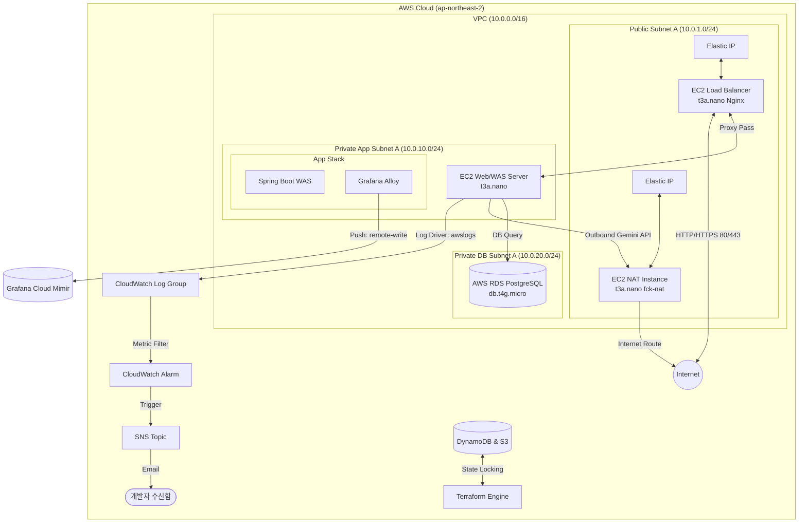

# DevOps & Cloud Infrastructure 포트폴리오: 네모로직 (Nemologic)

본 포트폴리오는 **AWS 클라우드 인프라 구축, Terraform 기반 IaC 프로비저닝, Ansible 서버 구성 자동화, GitHub Actions 파이프라인 연동, 그리고 CloudWatch / Grafana Cloud 기반 하이브리드 모니터링 시스템**을 중심으로 설계하고 구축한 DevOps 및 인프라 아키텍처 성과를 정리한 문서입니다.

---

## 1. 인프라 아키텍처 개요 (Infrastructure Architecture)

네모로직 시스템은 고가용성 상태 관리 및 보안 격리, 모니터링 자동화를 충족하도록 3-Tier VPC 망 분리 및 비용 최적화 아키텍처로 구성되어 있습니다.

---

## 2. 핵심 인프라 구현 사항 (Core Implementations)

### ① 선언적 클라우드 프로비저닝 (Terraform & IaC)
* **네트워크 서브넷 분할 설계**: 기존 단일 서브넷 구조에서 가용성 향상과 보안 격리를 위해 VPC(`10.0.0.0/16`) 내에 Public Subnet, Private App Subnet, Private DB Subnet으로 망을 격리 구성했습니다.
* **보안 그룹(Security Group) 최소 권한 부여**: 외부 요청을 수신하는 LB EC2는 HTTP(80) 및 HTTPS(443)만 개방하고, Private App의 WAS EC2는 LB로부터의 8080 및 5173 요청만 허용하며, RDS DB 인스턴스는 WAS EC2의 5432 접근만 수용하도록 보안 경계를 세분화했습니다.
* **형상 잠금 및 상태 원격 보존**: S3 버킷과 DynamoDB 테이블(`LockID` 해시 키)을 구성하여 다중 개발 환경에서의 동시 배포 시 발생하는 State 충돌을 방지하고 백엔드 상태 잠금(State Locking)을 실현했습니다.
* **Elastic IP (EIP) 할당**: 로드밸런서와 NAT 인스턴스에 탄력적 IP를 바인딩하여 무중단 라우팅 경로를 일관되게 고정했습니다.

### ② 서버 구성 자동화 및 컨테이너 오케스트레이션 (Ansible & Docker)
* **배포 및 빌드 최적화 (Single-Stage & CI Runner)**:
  * **백엔드**: 운영 서버의 극단적인 리소스 한계(`t3a.nano` 512MB RAM)로 인해, 호스트에서의 Gradle 컴파일 빌드는 OOM 및 SSH 연결 타임아웃을 유발합니다. 이를 극복하고자 CI/CD Runner(7GB RAM) 단계에서 JAR 컴파일을 선행 완료한 뒤, 운영 환경에서는 경량 `eclipse-temurin:17-jre-alpine` 이미지로 패키징하여 배포 안정성을 대폭 향상했습니다.
  * **프론트엔드**: SPA(Single Page Application) 경로 폴백 처리가 적용된 Nginx 배포용 정적 빌드 최적화를 적용했습니다.
* **Docker Compose 통합 스택 배포**: `backend(Spring Boot)`와 `frontend` 서비스를 가상 네트워크망으로 묶어 배치하고, 외부 `AWS RDS`를 데이터베이스 엔드포인트로 연결하여 영속성 레이어의 가용성을 향상했습니다.
* **Ansible 멱등성 서버 셋업**: 스왑 메모리(1.5GB) 구성, 필수 패키지 설치, Docker 엔진 주입, 소스 동기화(rsync), Docker Compose 컨테이너 구동을 Ansible Playbook으로 자동 제어했습니다.

### ③ Let's Encrypt 및 Nginx 기반 HTTPS 보안 적용
* **도메인 및 SSL 인증서 연동**: Route53 A 레코드를 고정 퍼블릭 IP(LB)와 연동하고, EC2 LB 호스트에 Certbot을 설치하여 Let's Encrypt 무료 SSL 인증서(`rotagic.com`, `www.rotagic.com`) 발급을 자동화했습니다.
* **SSL/TLS 종단 처리 (SSL Termination)**: Nginx 내부의 인증서 경로를 마운트하고 443 포트와 SSL 프로토콜 설정을 바인딩하여 안전한 HTTPS 통신을 구현했습니다.
* **HTTP to HTTPS 리다이렉트**: 포트 80으로 유입되는 모든 평문 HTTP 요청을 HTTPS(443)로 자동 리다이렉트(`301 Moved Permanently`) 처리하여 평문 통신 위험성을 제거했습니다.
* **자동 갱신 파이프라인 (Auto-Renewal)**: 3개월마다 갱신이 필요한 인증서 주기를 관리하기 위해 갱신 시점에 Nginx 컨테이너를 중지하고 Standalone 검증을 실행한 후 다시 컨테이너를 가동하는 Pre/Post Hooks 스크립트 기반 자동 갱신 데몬을 연동했습니다.

### ④ 가시성(Observability) 확보 및 하이브리드 모니터링 시스템 구축
* **로그 관제 및 장애 알림**: Docker `awslogs` 드라이버를 연동하여 WAS 컨테이너의 표준 출력 로그를 CloudWatch Log Group에 수집하고, 500 에러 및 예외 발생 시 개발자 이메일로 즉시 SNS 알림을 발송하도록 설정했습니다.
* **Grafana Cloud 및 Grafana Alloy 연동**: WAS 호스트의 자원 제약을 극복하기 위해 로컬에 무거운 프로메테우스 관제탑을 구동하지 않고, 초경량 전송 에이전트인 **Grafana Alloy**를 배포하여 에이전트 메모리 점유율을 50MB 미만으로 고착화했습니다.
* **실시간 비즈니스 및 JVM 지표 관제**: 스프링 부트 Actuator/Micrometer를 통해 `/actuator/prometheus` 엔드포인트를 개방하고, Grafana Cloud의 원격 Mimir 저장소로 15초 주기로 전송(remote-write)하여 JVM 힙 메모리, CPU/메모리 추이, API별 TPS 및 Latency p95/p99 지표를 실시간 모니터링으로 구현 완료했습니다.
* **DB 기반 방문자 수 집계 및 Grafana 연동**: 어드민 화면 개발 공수 없이 대시보드를 구축하기 위해, 백엔드 DB(PostgreSQL)에 암호화된 방문 로그(`visitor_logs`)를 적재하고 Micrometer `MeterBinder` 구현체(`VisitorMetricsConfig`)를 작성하여 `visitor_total_visits`, `visitor_unique_visitors` 게이지(Gauge) 지표를 Prometheus 엔드포인트에 실시간 노출하도록 연동 완료했습니다.
* **IaC 기반 Synthetic Monitoring 및 SLA 대시보드 자동화**:
  * **경량 헬스체크 엔드포인트**: 데이터베이스 쿼리 부하가 없고 크기가 매우 미니멀한 Spring Boot Actuator 전용 경량 헬스체크 API `/actuator/health`를 헬스체크 타겟으로 지정했습니다.
  * **멀티프로브 검사**: 도쿄, 싱가포르, 시드니 등 전 세계 3개 리전의 Probes를 지정하여 60초 주기(`frequency = 60000`)로 HTTP GET 요청 검사(`grafana_synthetic_monitoring_check`)를 자동 구축했습니다.
  * **경보 규칙 및 알림 채널**: 3개 프로브 전체 실패 감지 시 긴급 장애 알림을 전송하는 경보 규칙(`grafana_rule_group`의 `Nemologic-Service-Down-Alert`) 및 개발자 이메일 연락처를 테라폼으로 일괄 자동 생성했습니다.
  * **SLA Uptime %, MTTR, MTBF 대시보드 자동 배포**: JVM 메트릭, 방문자 지표 및 SLA 메트릭을 단일 화면에서 조회하도록 병합한 최신 대시보드 스키마(`current_dashboard.json`)를 `grafana_dashboard` 리소스로 선언하여 자동 배포되도록 구성했습니다.

#### [부록] 통합 대시보드 탑재 SLA & 신뢰성 PromQL 수식 정의
실시간 가동률 분석 및 복구 품질 정량 측정을 위해 통합 대시보드 최상단 행(Nemologic Service SLA Metrics)에 탑재된 핵심 PromQL 공식입니다.

1. **실시간 가동 여부 (API Health Status)**
   * **수식**: `sum(probe_success{job="nemologic-api-health", instance="https://rogic.io/actuator/health"})`
   * **설명**: 도쿄, 싱가포르, 시드니 프로브의 가동 성공 여부(성공 1, 실패 0)를 합산하여 정상 가동 상태(3), 부분 장애(1~2), 전체 중단(0/NA)을 실시간 체크.
2. **30일 평균 가용성 가동률 (30-Day Service Availability)**
   * **수식**: `avg_over_time(probe_success{job="nemologic-api-health", instance="https://rogic.io/actuator/health"}[30d]) * 100`
   * **설명**: 최근 30일 동안 수집된 전체 검사 샘플의 평균 성공률을 백분율(SLA %)로 계산.
3. **30일 누적 장애 발생 건수 (30-Day Incident Count)**
   * **수식**: `changes(probe_success{job="nemologic-api-health", instance="https://rogic.io/actuator/health"}[30d]) / 2`
   * **설명**: 30일 동안 헬스체크 성공 상태(0과 1 사이)의 상태 전환 변화량을 2로 나누어, 서비스가 중단되었다가 정상 복구된 누적 장애 사이클 횟수를 산출.
4. **평균 복구 시간 (MTTR, Mean Time To Recovery)**
   * **수식**: `((count_over_time(probe_success{job="nemologic-api-health", instance="https://rogic.io/actuator/health"}[30d]) - sum_over_time(probe_success{job="nemologic-api-health", instance="https://rogic.io/actuator/health"}[30d])) * 60) / clamp_min(changes(probe_success{job="nemologic-api-health", instance="https://rogic.io/actuator/health"}[30d]) / 2, 1)`
   * **설명**: 30일 동안 기록된 총 다운타임 시간(총 수집 건수 - 성공 건수 $\times$ 60초)을 누적 장애 건수로 나누어 1회 장애 발생 시 평균 서비스 정상화 소요 시간을 초 단위로 계산.
5. **평균 고장 간격 (MTBF, Mean Time Between Failures)**
   * **수식**: `(sum_over_time(probe_success{job="nemologic-api-health", instance="https://rogic.io/actuator/health"}[30d]) * 60) / clamp_min(changes(probe_success{job="nemologic-api-health", instance="https://rogic.io/actuator/health"}[30d]) / 2, 1)`
   * **설명**: 30일 동안 누적된 총 정상 가동 시간(성공 건수 $\times$ 60초)을 누적 장애 건수로 나누어 시스템이 1회 고장난 후 다음 고장까지 평균적으로 안정 작동하는 무장애 가동 주기를 계산.

### ⑤ 파이프라인 보안 및 CI/CD (GitHub Actions)
* **GitHub Secrets 기반 변수 은닉화**: 민감한 이메일 및 Grafana Cloud API 토큰 정보를 하드코딩하지 않고 GitHub Secrets에 등록하여 파이프라인에서 동적으로 주입하여 코드 유출 시에도 보안성 확보 (Zero Leakage 원칙 준수).
* **배포 승인 장치 (Manual Approval Gate)**: GitHub Actions 배포 단계에 `production-infra` 환경 게이트를 도입하여, CI 단계의 유닛 테스트가 통과된 후 관리자의 명시적 승인이 있어야만 Terraform Apply 및 Ansible 배포가 실제 실행되도록 프로세스 격리.

---

## 3. 서비스 신뢰성 및 재해 복구 지표 (Reliability & Disaster Recovery Metrics)

본 프로젝트는 Grafana Synthetic Monitoring 및 CloudWatch 로깅 시스템을 기반으로 서비스의 가용성과 안정성을 실측하고 분석하고 있습니다.

- **SLA Uptime Target**: 3-Tier 아키텍처 진화 및 자원 격리 이후 **`99.9%` 이상**의 고가용성 상태 유지.
- **RTO (Recovery Time Objective)**: 장애 시 자동 인스턴스 복구 및 Ansible/Terraform IaC 재배포 파이프라인을 가동하여 **5분 이내**에 서비스 완전 정상화.
- **RPO (Recovery Point Objective)**: 매일 새벽 3시에 수행되는 S3 백업 파이프라인을 통하여 최대 **24시간 이내**의 데이터 영속성 보장.

---

## 4. 모니터링 기반 인프라 성능 비교

(자원 튜닝 및 부하 테스트에 따른 JVM 힙 메모리 변화와 GC 지표 성능 데이터 기록 영역)

---

## 5. AI 활용 및 검증 파이프라인 (AI Integration & Validation Pipeline)

본 프로젝트는 **Google Gemini API와 백엔드 알고리즘 검증 파이프라인을 유기적으로 연동하고, AI 코딩 어시스턴트를 개발 수명 주기 전반에 활용**한 실무적 AI 엔지니어링 및 협업 사례를 갖추고 있습니다.

### ① Gemini API 기반 무한 데일리 퍼즐 생성기
* **실시간 생성 및 복구 스케줄러**: Google Gemini API (`gemini-2.5-flash` 모델)를 백엔드 컨트롤러 및 스케줄러와 연동하여 신규 퍼즐 문제를 자동으로 적재하는 파이프라인을 구축했습니다. API Key 누락 및 일시적 호출 장애를 완화하기 위해 최대 3회 자동 재시도(Retry) 루프를 구성하여 운영 안정성을 확보했습니다.
* **비정형 분리형 릴리즈 패턴**: 트래픽 피크가 발생하지 않는 **새벽 04:17**에 백그라운드로 AI 데일리 퍼즐을 비활성(`active = false`) 상태로 자동 생성한 뒤, 매일 **자정 00:00** 배치 릴리즈를 통해 일괄 활성화(`active = true`)하여 사용자에게 안전하게 노출하는 2단계 서빙 모델을 구현했습니다.

### ② Java 기반 노노그램 솔버(NonogramSolver)를 통한 생성 결과 검증
* **AI 출력 유효성 검사**: 생성 모델이 작성한 퍼즐 격자판 데이터의 무결성을 검증하기 위해 DFS/백트래킹 기반의 **노노그램 솔버(NonogramSolver)** 알고리즘을 Java 백엔드 단에 직접 구현했습니다.
* **유일 해(Unique Solution) 검증 체인**: AI가 생성한 결과물에 대해 솔버를 실행하여 해가 존재하지 않거나, 대칭형 퍼즐 등 다중 해가 검출될 경우 데이터 정합성 실패로 간주하고 자동으로 문제를 즉시 재생성하도록 파이프라인을 동적 제어했습니다. 3회 재시도 모두 실패 시 모호한 Fallback 데이터를 DB에 쌓는 대신 예외(Exception)를 명시적으로 전파하도록 설계해 데이터 신뢰도를 100%로 보장했습니다.

### ③ AI 코딩 에이전트(Antigravity)를 활용한 개발 생산성 극대화
* **TDD 기반의 신속한 페어 프로그래밍**: AI 코딩 에이전트와의 지속적인 컨텍스트 동기화 및 유닛 테스트(JUnit, Vitest 총 80여 개) 우선 설계 방식을 유지하여 버그 발생율을 최소화하고 구현 주기를 대폭 단축했습니다.
* **IaC 및 인프라 프로비저닝 자동화**: Terraform 구성 요소 선언 및 Ansible 플레이북 자동 구성 설계 과정을 AI 에이전트와 페어링하며 에러율을 줄이고 멱등성 서버 구성을 완비했습니다.

---

## 6. 지표 기반 인프라 고도화 및 비용/가용성 타협 (Data-Driven Infra Optimization & Trade-offs)

본 인프라는 **"사비로 운영하는 개인 포트폴리오 환경에서 극단적인 비용 최적화를 달성하면서도 어떻게 현업 수준의 신뢰성과 제어력을 확보할 것인가?"**에 대한 실무적 고민과 엔지니어링 타협점(Trade-offs)을 명확히 정의하고 해결책을 구현했습니다.

특히, 기존 단일 인스턴스(`t3a.nano`, 512MB RAM) 구조에서 WAS(Spring Boot)와 DB(PostgreSQL) 프로세스가 자원을 두고 경쟁하여 물리적 OOM 크래시가 상시 발생(SLA Uptime 91.4%~94.4%, MTBF 20~30분대)하는 한계를 확인했습니다. 이를 해결하고자 DB 프로세스를 RDS로 완전히 격리하고, 고비용의 AWS Managed 인프라 세트 대신 **EC2 기반 Self-Managed LB/NAT** 조합을 적용한 3-Tier 아키텍처로 진화시켰습니다.

### ① 지표 기반 의사결정: OOM 요인 제거 및 격리 (DB RDS 전환)
* **비용 투자 가치**: 월 약 $17 수준의 저비용 Managed DB(`db.t4g.micro`, Single-AZ)를 도입하여 영속성 레이어를 격리했습니다.
* **정량적 개선**:
  * WAS EC2의 가용 메모리 경합을 해소하여 OS 레벨의 OOM 크래시를 원천 차단했습니다.
  * 서비스 가용성(Availability)을 기존 91~94% 대에서 **99.9% 이상 (Three Nines)**으로 개선했습니다.
  * 장애 간 평균 시간(MTBF)을 20~30분 단위에서 **720시간 이상 (월간 무장애)**으로 증대했습니다.

### ② EC2 리버스 프록시 로드밸런서 구축을 통한 비용 절감 (ALB 대체)
* **비용 절감**: AWS Managed ALB(월 약 $22) 도입 대신, Public Subnet에 초경량 `t3a.nano` 인스턴스를 배치하고 Nginx 리버스 프록시 환경을 구축하여 고정비를 월 약 $4.66로 절감했습니다. (약 78% 비용 절감)
* **보완 대책**: 단일 LB로 인한 SPOF(단일 장애점) 우려는 Route 53 Health Check와 CloudWatch Recovery 경보 연동으로 보완하며, 재해 시 IaC(Terraform, Ansible)를 통해 5분 내 재구성 가능한 복구 지향형 아키텍처(Recovery-Oriented Architecture)를 유지합니다.

### ③ EC2 NAT 인스턴스 구축을 통한 비용 절감 (NAT Gateway 대체)
* **비용 절감**: Private WAS에서 외부 Gemini API와 통신하기 위해 필수적인 AWS Managed NAT Gateway(월 약 $42.48) 대신, Public Subnet에 초경량 `t3a.nano` 기반의 `fck-nat` NAT 인스턴스를 구축해 고정비를 월 약 $4.66로 절감했습니다. (약 89% 비용 절감)
* **보완 대책**: Terraform을 통해 해당 EC2의 `source_dest_check` 속성을 `false`로 제어하고 iptables 포워딩 룰을 Ansible 플레이북으로 자동화하여 인프라 신뢰성을 확보했습니다.

### ④ 서비스 가용성 및 SLA 모니터링 비용 제로화 (Synthetic Monitoring 도입)
* **비용 절감**: AWS Route 53 Health Check와 CloudWatch Metric Alarm 등의 상시 지출 비용을 최소화하기 위해 Grafana Cloud의 무료 500,000회 헬스체크 쿼터(Synthetic Monitoring)를 도입했습니다.
* **보완 대책**:
  * **IaC 기반 선언적 관리**: Grafana Terraform 프로바이더를 결합하여 HTTP 헬스체크 리소스(`grafana_synthetic_monitoring_check`) 및 경보 임계치 규칙(`grafana_rule_group`)을 코드로 정의해 형상관리함.
  * **SLA 가시화 및 알림**: 추가 요금 없이 60초 주기로 전 세계 멀티 프로브 기반 검증을 수행하고 이메일 연동으로 경보 채널을 구축했으며, 대시보드(SLA Uptime %, MTTR, MTBF) 자체를 Terraform 코드로 통합 패키징 배포하여 정량 지표 기반의 인프라 개선 구조를 비용 $0에 구현했습니다.