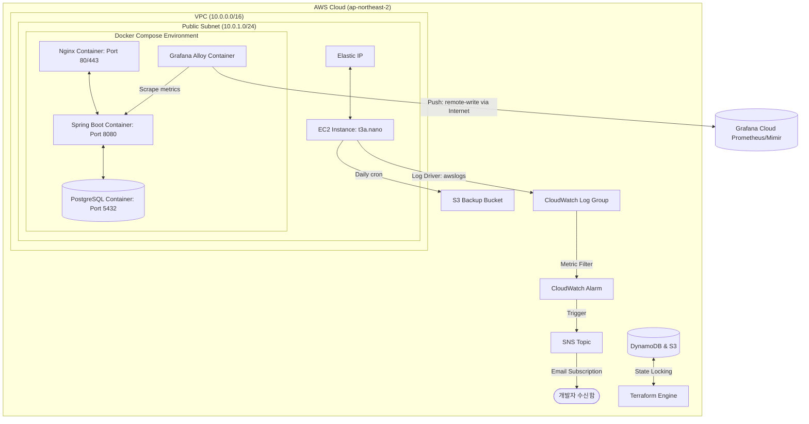

# DevOps & Cloud Infrastructure 포트폴리오: 네모로직 (Nemologic)

본 포트폴리오는 **AWS 클라우드 인프라 구축, Terraform 기반 IaC 프로비저닝, Ansible 서버 구성 자동화, GitHub Actions 파이프라인 연동, 그리고 CloudWatch / Grafana Cloud 기반 하이브리드 모니터링 시스템**을 중심으로 설계하고 구축한 DevOps 및 인프라 아키텍처 성과를 정리한 문서입니다.

---

## 1. 인프라 아키텍처 개요 (Infrastructure Architecture)

네모로직 시스템은 고가용성 상태 관리 및 보안 격리, 모니터링 자동화를 충족하도록 클라우드 아키텍처가 구성되어 있습니다.

---

## 2. 핵심 인프라 구현 사항 (Core Implementations)

### ① 선언적 클라우드 프로비저닝 (Terraform & IaC)
* **VPC 및 네트워크 설계**: 단일 서브넷 구조 of VPC(`10.0.0.0/16`)와 퍼블릭 서브넷(`10.0.1.0/24`), 인터넷 게이트웨이(IGW), 라우트 테이블 매핑을 코드로 제어.
* **보안 그룹(Security Group) 최소 권한 부여**: SSH(22), Nginx HTTP(80), HTTPS(443), Spring Boot HTTP(8080) 포트 인입만 허용하고 아웃바운드는 전면 오픈.
* **형상 잠금 및 상태 원격 보존**: S3 버킷과 DynamoDB 테이블(`LockID` 해시 키)을 구성하여 다중 개발 환경에서의 동시 배포 시 발생하는 State 충돌을 방지하고 백엔드 상태 잠금(State Locking)을 실현.
* **Elastic IP (EIP) 할당**: 서버 재부팅 시에도 일관된 DNS 레코드 주소 및 API 연동 엔드포인트를 유지하도록 탄력적 IP 고정 결합.

### ② 서버 구성 자동화 및 컨테이너 오케스트레이션 (Ansible & Docker)
* **배포 및 빌드 최적화 (Single-Stage & CI Runner)**:
  * **백엔드**: `t3a.nano` (512MB RAM)의 극단적인 리소스 한계로 인해, 호스트에서의 Gradle 컴파일 빌드는 OOM 및 SSH 연결 타임아웃을 유발함. 이를 극복하고자 CI/CD Runner(7GB RAM) 단계에서 JAR 컴파일을 선행 완료한 뒤, 운영 환경에서는 경량 `eclipse-temurin:17-jre-alpine` 이미지로 패키징하여 배포 안정성을 대폭 향상.
  * **프론트엔드**: SPA(Single Page Application) 경로 폴백 처리가 적용된 Nginx 배포용 정적 빌드 최적화.
* **Docker Compose 통합 스택 배포**: `db(Postgres)`, `backend(Spring Boot)`, `frontend(Nginx)` 서비스를 가상 네트워크망으로 묶어 배치하고 `depends_on` 헬스체크 설정을 통해 DB의 준비 상태를 확인한 뒤 백엔드가 롤링업되도록 제어.
* **Ansible 멱등성 서버 셋업**: 스왑 메모리(1.5GB) 구성, 필수 패키지 설치, Docker 엔진 주입, 소스 동기화(rsync), Docker Compose 컨테이너 빌드 및 구동을 Ansible Playbook으로 자동 제어.
* **자동 백업 크론탭(Cron Job)**: 매일 새벽 3시에 Postgres DB 전체 덤프 데이터 및 gzip 압축본을 생성해 고유 해시명으로 네이밍된 S3 버킷 저장소에 주기적으로 소산시키는 쉘 스크립트 작성 및 cron 자동화 연동.

### ③ Let's Encrypt 및 Nginx 기반 HTTPS 보안 적용
* **도메인 및 SSL 인증서 연동**: Route53 A 레코드를 고정 퍼블릭 IP와 연동하고, EC2 호스트에 Certbot을 설치하여 Let's Encrypt 무료 SSL 인증서(`rotagic.com`, `www.rotagic.com`) 발급 자동화.
* **SSL/TLS 종단 처리 (SSL Termination)**: Nginx 컨테이너 내부에 `/etc/letsencrypt` 인증서 경로를 마운트하고 443 포트와 SSL 프로토콜 설정을 바인딩하여 안전한 HTTPS 통신 구현.
* **HTTP to HTTPS 리다이렉트**: 포트 80으로 유입되는 모든 평문 HTTP 요청을 HTTPS(443)로 자동 리다이렉트(`301 Moved Permanently`) 처리하여 평문 통신 위험성 전면 제거.
* **자동 갱신 파이프라인 (Auto-Renewal)**: 3개월마다 갱신이 필요한 인증서 주기를 관리하기 위해, 갱신 시점에 Nginx 컨테이너를 중지하고 Standalone 검증을 실행한 후 다시 컨테이너를 가동하는 Pre/Post Hooks 스크립트 기반 자동 갱신 데몬 연동.

### ④ 가시성(Observability) 확보 및 하이브리드 모니터링 시스템 구축
* **로그 관제 및 장애 알림**: Docker `awslogs` 드라이버를 연동하여 컨테이너가 배출하는 표준 출력 로그를 CloudWatch Log Group `/aws/ec2/nemologic`에 자동 수집. 500 에러 및 애플리케이션 크래시 예외를 지표화하는 CloudWatch Logs Metric Filter와 알람을 구축하여 장애 발생 시 개발자 이메일로 즉시 SNS 알림 발송.
* **Grafana Cloud 및 Grafana Alloy 연동**: t3a.nano의 자원 제약(512MB RAM)을 해소하기 위해 로컬에 무거운 프로메테우스 서버를 구동하지 않고, 초경량 전송 에이전트인 **Grafana Alloy**를 배포하여 메모리 점유율을 50MB 미만으로 고착화.
* **실시간 비즈니스 및 JVM 지표 관제**: 스프링 부트 Actuator/Micrometer를 통해 `/actuator/prometheus` 엔드포인트를 개방하고, Grafana Cloud의 원격 Prometheus 저장소(Mimir)로 15초 주기로 전송(remote-write). Grafana 대시보드(ID: 11378)를 연동하여 JVM 힙 메모리, CPU/메모리 추이, API별 TPS 및 Latency p95/p99 지표를 실시간 모니터링으로 구현 완료.
* **DB 기반 방문자 수 집계 및 Grafana 연동**: 어드민 화면 개발 공수 없이 대시보드를 구축하기 위해, 백엔드 DB(PostgreSQL)에 암호화된 방문 로그(`visitor_logs`)를 적재하고 Micrometer `MeterBinder` 구현체(`VisitorMetricsConfig`)를 작성하여 `visitor_total_visits`, `visitor_unique_visitors`, `visitor_daily_unique_visitors` 게이지(Gauge) 지표를 Prometheus 엔드포인트에 실시간 노출하도록 연동 완료.
* **IaC 기반 Synthetic Monitoring 및 SLA 대시보드 자동화**:
  * **경량 헬스체크 엔드포인트**: 기존 전체 스테이지 목록 API(`/api/stages`) 대신 데이터베이스 쿼리 부하가 없고 크기가 매우 미니멀한 Spring Boot Actuator 전용 경량 헬스체크 API `/actuator/health`를 헬스체크 타겟으로 지정. 보안을 위해 Nginx 리버스 프록시(`nginx.prod.conf`)에서 외부에는 해당 엔드포인트 경로만 선별적으로 노출.
  * **멀티프로브 검사**: 도쿄, 싱가포르, 시드니 등 전 세계 3개 리전의 Probes를 지정하여 60초 주기(`frequency = 60000`)로 HTTP GET 요청 검사(`grafana_synthetic_monitoring_check`) 자동 구축.
  * **경보 규칙 및 알림 채널**: 3개 프로브 전체 실패 감지 시 긴급 장애 알림을 전송하는 경보 규칙(`grafana_rule_group`의 `Nemologic-Service-Down-Alert`) 및 개발자 이메일 연락처(`grafana_contact_point`)를 테라폼으로 일괄 자동 생성. (수동 설정인 Grafana UI 상의 Notification Policy를 통해 레이블 `severity=critical`과 `Developer-Email-Alerts` 연락처를 연결해 작동).
  * **통합 SLA 및 통계 대시보드 (IaC 병합)**: JVM 메트릭, 방문자 지표 및 SLA 메트릭을 단일 화면에서 조회하도록 병합한 최신 대시보드 스키마(`current_dashboard.json`)를 `grafana_dashboard` 리소스로 선언하여 자동 배포. 대시보드 내 모든 Prometheus 데이터소스 참조를 `"${DS_PROMETHEUS}"` 변수 형식으로 파라미터화하고, 테라폼의 `replace()` 함수를 통해 실제 프로바이더 데이터소스 UID로 동적 변환 주입하여 배포 이식성 극대화.

#### [부록] 통합 대시보드 탑재 SLA & 신뢰성 PromQL 수식 정의
실시간 가동률 분석 및 복구 품질 정량 측정을 위해 통합 대시보드 최상단 행(Nemologic Service SLA Metrics)에 탑재된 핵심 PromQL 공식입니다.

1. **실시간 가동 여부 (API Health Status)**
   * **수식**: `sum(probe_success{job="nemologic-api-health"})`
   * **설명**: 도쿄, 싱가포르, 시드니 프로브의 가동 성공 여부(성공 1, 실패 0)를 합산하여 정상 가동 상태(3), 부분 장애(1~2), 전체 중단(0/NA)을 실시간 체크.
2. **30일 평균 가용성 가동률 (30-Day Service Availability)**
   * **수식**: `avg_over_time(probe_success{job="nemologic-api-health"}[30d]) * 100`
   * **설명**: 최근 30일 동안 수집된 전체 검사 샘플의 평균 성공률을 백분율(SLA %)로 계산.
3. **30일 누적 장애 발생 건수 (30-Day Incident Count)**
   * **수식**: `changes(probe_success{job="nemologic-api-health"}[30d]) / 2`
   * **설명**: 30일 동안 헬스체크 성공 상태(0과 1 사이)의 상태 전환 변화량을 2로 나눠, 서비스가 중단되었다가 정상 복구된 누적 장애 사이클 횟수를 산출.
4. **평균 복구 시간 (MTTR, Mean Time To Recovery)**
   * **수식**: `((count_over_time(probe_success{job="nemologic-api-health"}[30d]) - sum_over_time(probe_success{job="nemologic-api-health"}[30d])) * 60) / clamp_min(changes(probe_success{job="nemologic-api-health"}[30d]) / 2, 1)`
   * **설명**: 30일 동안 기록된 총 다운타임 시간(총 수집 건수 - 성공 건수 $\times$ 60초)을 누적 장애 건수로 나누어 1회 장애 발생 시 평균 서비스 정상화 소요 시간을 초 단위로 계산.
5. **평균 고장 간격 (MTBF, Mean Time Between Failures)**
   * **수식**: `(sum_over_time(probe_success{job="nemologic-api-health"}[30d]) * 60) / clamp_min(changes(probe_success{job="nemologic-api-health"}[30d]) / 2, 1)`
   * **설명**: 30일 동안 누적된 총 정상 가동 시간(성공 건수 $\times$ 60초)을 누적 장애 건수로 나누어 시스템이 1회 고장난 후 다음 고장까지 평균적으로 안정 작동하는 무장애 가동 주기를 계산.

### ⑤ 파이프라인 보안 및 CI/CD (GitHub Actions)
* **GitHub Secrets 기반 변수 은닉화**:
  * 민감한 이메일 및 Grafana Cloud API 토큰 정보를 하드코딩하지 않고 GitHub Secrets에 등록.
  * Terraform 실행 및 Ansible 배포 시 환경변수로 매핑 및 파이프라인에서 동적으로 주입하여 코드 유출 시에도 보안성 확보 (Zero Leakage 원칙 준수).
* **배포 승인 장치 (Manual Approval Gate)**: GitHub Actions 배포 단계에 `production-infra` 환경 게이트를 도입하여, CI 단계의 유닛 테스트가 통과된 후 관리자의 명시적 승인이 있어야만 Terraform Apply 및 Ansible 배포가 실제 실행되도록 프로세스 격리.

---

## 3. 서비스 신뢰성 및 재해 복구 지표 (Reliability & Disaster Recovery Metrics)

본 인프라 아키텍처의 가용성 수준과 복구 능력을 정량적으로 평가하기 위해 RPO, RTO, MTBF, MTTR 지표를 산정하고 개선 목표를 매핑했습니다.

### ① RPO (Recovery Point Objective, 복구 시점 목표)
* **현재 지표**: **24시간**
  * 매일 새벽 3시에 수행되는 1일 1회 DB 백업 및 S3 소산에 의존하므로, 재해 발생 시 최대 24시간 분량의 데이터 유실 가능성이 존재함.
* **목표 사양**: **5분 이내**
  * AWS RDS 도입 후 자동 백업 스냅샷 기능 및 실시간 트랜잭션 로그(WAL) 백업을 활성화하여 시점 복구(Point-in-Time Recovery) 환경을 구축함으로써 데이터 유실을 최소화함.

### ② RTO (Recovery Time Objective, 복구 시간 목표)
* **현재 지표**: **약 20분**
  * 단일 EC2 인스턴스가 완전히 붕괴되는 장애 상황 시, Terraform 프로비저닝 재생성 및 Ansible 소스 배포 파이프라인 구동, S3 덤프 데이터를 활용한 DB 복구 완료까지 수동 개입을 포함하여 약 20분이 소요됨.
* **목표 사양**: **1분 이내 (무중단)**
  * 로드 밸런서(ALB) 전면 배치 및 다중 가용 영역(Multi-AZ) 기반의 ECS Fargate 이중화를 구성하여 Task 헬스 체크 실패 시 트래픽을 즉시 정상 노드로 격리하고 인스턴스를 자동 대체함.

### ③ MTBF (Mean Time Between Failures, 평균 고장 간격)
* **현재 지표**: **낮음 (평균 1~2개월 내 예외 발생 가능성)**
  * EC2 t3a.nano(메모리 0.5GB) 단일 컴퓨팅 노드 환경에서 JVM 및 DB 컨테이너가 공존하므로 트래픽 급증 시 Out of Memory(OOM)로 인한 OS 크래시 취약성이 높음.
* **목표 사양**: **매우 높음 (1년 이상 무장애 타겟)**
  * 서버 자원을 ECS Fargate와 AWS RDS로 완벽히 격리 및 메모리를 2GB 이상 증설하여 노드 수준의 리소스 고갈 요인을 근본적으로 해결함.

### ④ MTTR (Mean Time To Repair, 평균 복구 시간)
* **현재 지표**: **약 10분**
  * CloudWatch Logs의 5분 임계 경보 발생 후 관리자가 슬랙/이메일 알림을 인지하고 SSH에 접근하여 `docker compose restart` 등으로 수동 복구하는 시간.
* **목표 사양**: **10초 이내 (자동화)**
  * ECS Fargate의 컨테이너 자동 복구(Self-healing) 루프와 ALB 타겟 그룹의 헬스체크 임계치 조정을 통해 장애 감지 즉시 비정상 노드를 제거하고 새로운 Task로 자동 전환함.

---

## 4. 누락된 부분 및 향후 보완 과제 (Missing Components & Roadmaps)

현재 구축된 인프라는 단일 EC2 인스턴스 환경을 타겟으로 한 소규모/스타트업 실습용 표준 사양입니다. 실제 엔터프라이즈 프로덕션 환경에 투입하기 위해 보완되어야 할 사항 및 권장 아키텍처 요소를 정리했습니다.

### ① 네트워크 다중 보안 격리 부족 (Private Subnet 전환)
* **현재 상태**: 단일 Public Subnet 내에 EC2 인스턴스가 존재하며, PostgreSQL 컨테이너 역시 동일 인스턴스 내에 직접 노출되어 있습니다.
* **개선 방향**:
  * DB(PostgreSQL)를 Public 서브넷에서 격리하여 **Private Subnet**으로 이동시키고, AWS RDS(Managed DB Service)를 다중 AZ(Availability Zone) 구조로 도입.
  * EC2 웹 서버 역시 Private Subnet으로 내리고 외부 요청은 Public Subnet의 ALB를 통해서만 유입되도록 보안 차단막 구성. SSH 접근은 AWS SSM Session Manager 또는 Bastion Host를 통해서만 허용.

### ② 단일 장애점(SPOF) 해소 및 고가용성(HA) 구성
* **현재 상태**: 단일 EC2 인스턴스 내에 Docker Compose로 전체 서비스가 실행 중이므로, 해당 인스턴스에 장애가 발생하면 전체 시스템이 다운됩니다.
* **개선 방향**:
  * EC2 인스턴스를 Auto Scaling Group(ASG)으로 묶고 ALB와 결합하여 트래픽 증가 또는 인스턴스 장애 발생 시 동적으로 복구/스케일 아웃되도록 설계.
  * Docker Compose 구조를 AWS의 컨테이너 관리 서비스인 **ECS (Fargate)** 및 **EKS (Kubernetes)**로 마이그레이션하여 무중단 배포(Rolling, Blue-Green)와 자동 복구(Self-healing) 환경 확보.

### ③ 비밀번호 및 API 키 관리 체계 강화
* **현재 상태**: `.env` 파일 내에 `AI_API_KEY`와 DB 패스워드가 로컬 텍스트 파일로 주입되어 있습니다.
* **개선 방향**:
  * **AWS Systems Manager Parameter Store** 또는 **AWS Secrets Manager**와 통합하여 환경 변수 및 패스워드를 인프라 관리 서비스에 저장하고, 애플리케이션 기동 시 스프링 부트가 프로파일을 기반으로 IAM Role 권한을 사용해 API 호출 방식으로 dynamic fetch 하도록 연동.

### ④ DevSecOps 및 자동화된 보안 취약성 검사 도입
* **현재 상태**: GitHub Actions를 통해 CI/CD 파이프라인(테스트, 빌드, 배포)이 자동화되어 있으나, 소스 코드 자체의 취약성이나 컨테이너 이미지, 종속 라이브러리의 보안 취약성을 사전에 검증하는 자동화된 보안 스캔 프로세스가 부재합니다.
* **개선 방향**:
  * **정적 애플리케이션 보안 테스트 (SAST)**: GitHub Actions 빌드 워크플로우에 **SonarQube** 또는 GitHub **CodeQL** 스캔 단계를 연동하여 병합 및 배포 전 소스 코드의 보안 약점(OWASP Top 10 등)을 감지.
  * **오픈소스 라이브러리 취약성 검사 (SCA)**: Gradle 및 npm 종속성 라이브러리의 알려진 취약점(CVE)을 검출하기 위해 **OWASP Dependency-Check** 또는 **Snyk** 등을 파이프라인에 포함.
  * **컨테이너 이미지 취약성 스캔**: 빌드된 Docker 이미지를 AWS ECR에 푸시하거나 EC2에 배포하기 전에 **Trivy** 또는 **Anchore** 스캔 단계를 수행하여 OS 패키지 및 런타임 환경의 취약점을 탐지하고, 기준 보안 레벨(예: High/Critical) 미달 시 배포를 차단(Quality Gate).

---

## 5. AI 활용 및 검증 파이프라인 (AI Integration & Validation Pipeline)

본 프로젝트는 **Google Gemini API와 백엔드 알고리즘 검증 파이프라인을 유기적으로 연동하고, AI 코딩 어시스턴트를 개발 수명 주기 전반에 활용**한 실무적 AI 엔지니어링 및 협업 사례를 갖추고 있습니다.

### ① Gemini API 기반 무한 데일리 퍼즐 생성기
* **실시간 생성 및 복구 스케줄러**: Google Gemini API (`gemini-2.5-flash` 모델)를 백엔드 컨트롤러 및 스케줄러와 연동하여 신규 퍼즐 문제를 자동으로 적재하는 파이프라인을 구축했습니다. API Key 누락 및 일시적 호출 장애를 완화하기 위해 최대 3회 자동 재시도(Retry) 루프를 구성하여 운영 안정성을 확보했습니다.
* **비정형 분리형 릴리즈 패턴**: 트래픽 피크가 발생하지 않는 **새벽 04:17**에 백그라운드로 AI 데일리 퍼즐을 비활성(`active = false`) 상태로 자동 생성한 뒤, 매일 **자정 00:00** 배치 릴리즈를 통해 일괄 활성화(`active = true`)하여 사용자에게 안전하게 노출하는 2단계 서빙 모델을 구현했습니다.

### ② Java 기반 노노그램 솔버(NonogramSolver)를 통한 생성 결과 검증
* **AI 출력 유효성 검사**: 생성 모델이 작성한 퍼즐 격자판 데이터의 무결성을 검증하기 위해 DFS/백트래킹 기반의 **노노그램 솔버(NonogramSolver)** 알고리즘을 Java 백엔드 단에 직접 구현했습니다.
* **유일 해(Unique Solution) 검증 체인**: AI가 생성한 결과물에 대해 솔버를 실행하여 해가 존재하지 않거나, 대칭형 퍼즐 등 다중 해가 검출될 경우 데이터 정합성 실패로 간주하고 자동으로 문제를 즉시 재생성하도록 파이프라인을 동적 제어했습니다. 3회 재시도 모두 실패 시 모호한 Fallback 데이터를 DB에 쌓는 대신 예외(Exception)를 명시적으로 전파하도록 설계해 데이터 신뢰도를 100%로 보장했습니다.

### ③ AI 코딩 에이전트(Antigravity)를 활용한 개발 생산성 극대화
* **TDD 기반의 신속한 페어 프로그래밍**: AI 코딩 에이전트와의 지속적인 컨텍스트 동기화 및 유닛 테스트(JUnit, Vitest 총 80여 개) 우선 설계 방식을 유지하여 버그 발생율을 최소화하고 구현 주기를 대폭 단축했습니다.
* **IaC 및 인프라 프로비저닝 자동화**: Terraform 구성 요소 선언 및 Ansible 플레이북 자동 구성 설계 과정을 AI 에이전트와 페어링하며 에러율을 줄이고 멱등성 서버 구성을 완비했습니다.

---

## 6. 비용 최적화 및 타협 설계 (Self-Funded Infra Cost Optimization & Trade-offs)

본 인프라는 **"사비로 운영하는 개인 포트폴리오 환경에서 극단적인 비용 최적화를 달성하면서도 어떻게 현업 수준의 신뢰성과 제어력을 확보할 것인가?"**에 대한 실무적 고민과 엔지니어링 타협점(Trade-offs)을 명확히 정의하고 해결책을 구현했습니다.

### ① 무상태(Stateless) 인프라 설계를 통한 고가용성 타협 (ALB 배제)
* **비용 절감**: AWS ALB(L7 로드밸런서) 기동 시 발생하는 고정 요금(월 약 $20)을 절감하기 위해 Route 53과 단일 EC2 인스턴스 구조로 아키텍처를 단순화했습니다.
* **보완 대책**: 이중화 비용을 지출하는 대신, 인스턴스 장애 시 CloudWatch 경보와 연동한 자동 재기동(Auto Recovery)을 설정하고, 재해 발생 시 Terraform과 Ansible로 정의된 IaC 코드를 활용하여 5분 이내에 인프라 전체를 동일하게 재생성 및 재배포할 수 있는 **복구 지향형 아키텍처(Recovery-Oriented Architecture)**를 검증했습니다.

### ② Self-Hosted 컨테이너와 S3 백업 파이프라인 (RDS 대체)
* **비용 절감**: AWS RDS `db.t4g.micro` 또는 `db.t3.micro` 등 관리형 DB 구동 비용(월 약 $15~20 이상)을 방지하기 위해 단일 EC2 내 Docker Compose 기반 PostgreSQL 컨테이너 구조로 타협했습니다.
* **보완 대책**: RDS의 백업/스냅샷 편의성에 의존하는 대신, 매일 지정된 시간(새벽 3시)에 DB 덤프파일을 안전하게 압축하여 AWS S3 버킷으로 자동 소산시키는 **백업 자동화 파이프라인**을 직접 수동 설계하여 데이터 신뢰성과 인프라 제어력을 입증했습니다.

### ③ 자원 제약 환경에 따른 애플리케이션 및 모니터링 최적화
* **비용 절감**: 포트폴리오의 장기 운영을 위해 월 약 $3.5 수준의 극단적 저비용 컴퓨팅 노드인 `t3.nano` / `t4g.nano` (512MB RAM) 환경을 목표 사양으로 고정했습니다.
* **보완 대책**:
  * **초경량 에이전트 채택**: 로컬 인스턴스 내 무거운 Prometheus/Grafana 통합 관제탑을 구축하지 않고, Go 기반 초경량 수집기인 **Grafana Alloy**를 활용해 타겟 메트릭만 Grafana Cloud로 원격 전송(remote-write)함으로써 에이전트 메모리 점유율을 50MB 이하로 통제했습니다.
  * **JVM 리소스 튜닝**: Spring Boot 런타임의 GC(Garbage Collector) 및 Metaspace 설정을 제약된 하드웨어에 맞춰 튜닝하고, 향후 GraalVM Native Image 컴파일 빌드를 통해 부트스트랩 메모리를 50MB 이하로 낮추는 메모리 다이어트 기술 로드맵을 수립했습니다.

### ④ 서비스 가용성 및 SLA 모니터링 비용 제로화 (Synthetic Monitoring 도입)
* **비용 절감**: AWS Route 53 Health Check와 CloudWatch Metric Alarm 등의 상시 지출 비용을 최소화하기 위해 Grafana Cloud의 무료 500,000회 헬스체크 쿼터(Synthetic Monitoring)를 도입했습니다.
* **보완 대책**:
  * **IaC 기반 선언적 관리**: Grafana Terraform 프로바이더를 결합하여 HTTP 헬스체크 리소스(`grafana_synthetic_monitoring_check`) 및 경보 임계치 규칙(`grafana_rule_group`)을 코드로 정의해 형상관리함.
  * **SLA 가시화 및 알림**: 추가 요금 없이 60초 주기로 전 세계 멀티 프로브 기반 검증을 수행하고 이메일 연동으로 경보 채널을 구축했으며, 대시보드(SLA Uptime %, MTTR, MTBF) 자체를 Terraform 코드로 통합 패키징 배포하여 정량 지표 기반의 인프라 개선 구조를 비용 $0에 구현함.
